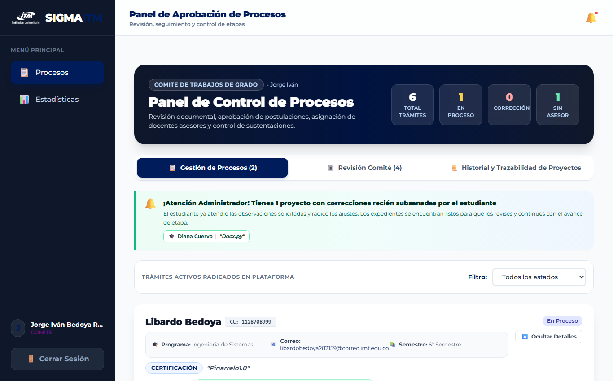
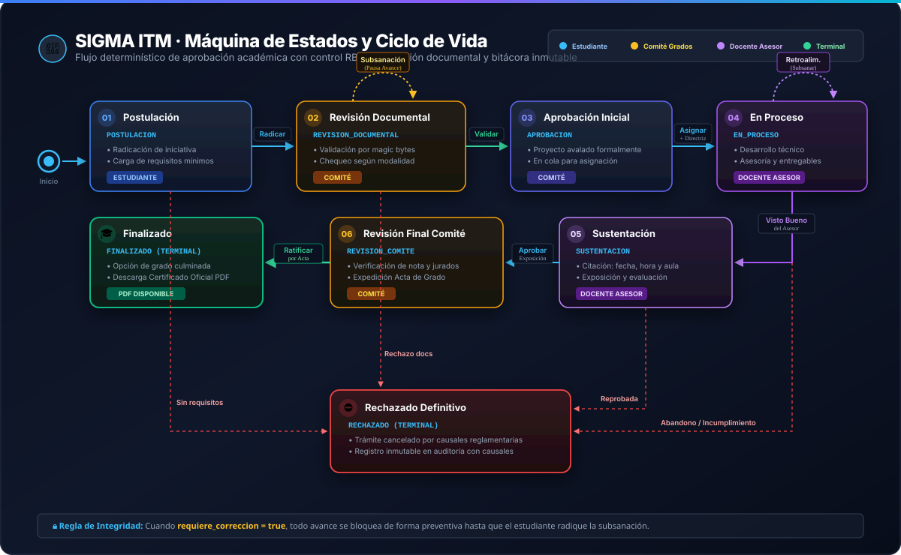
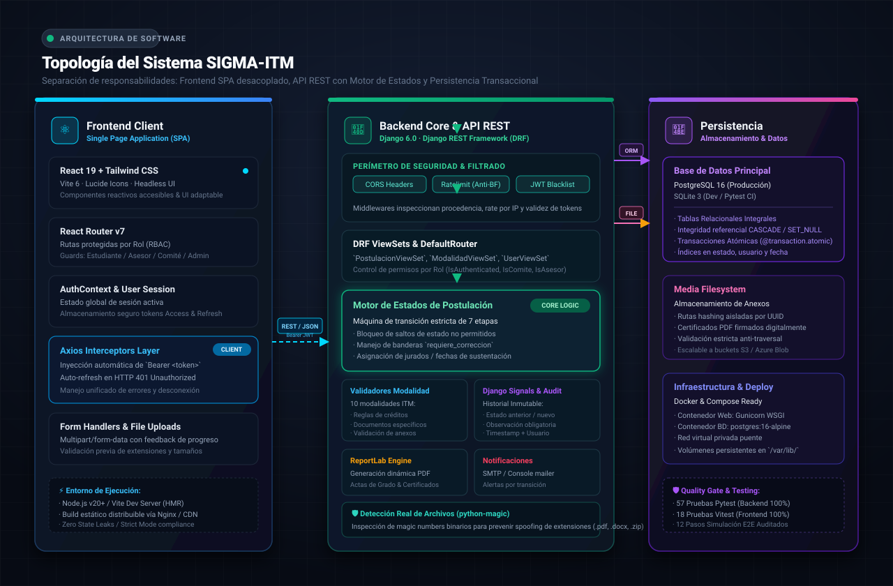
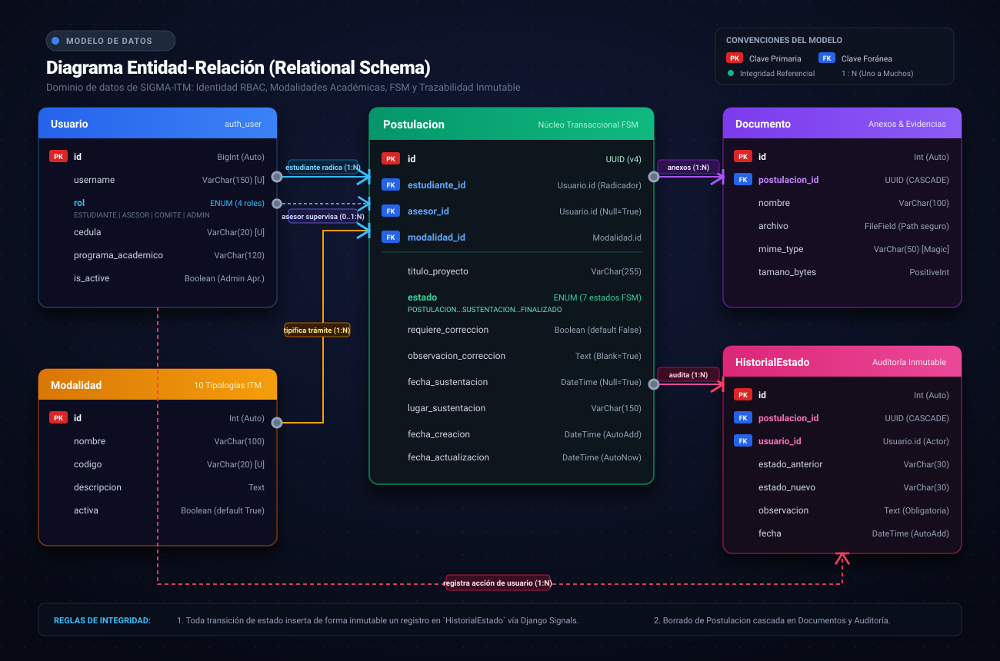

# 🎓 SIGMA ITM — Sistema Integral de Gestión de Modalidades de Grado

<div align="center">


<br/>

[](https://www.djangoproject.com/)
[](https://www.django-rest-framework.org/)
[](https://react.dev/)
[](https://tailwindcss.com/)
[](https://www.postgresql.org/)
[](https://pytest.org/)

**Plataforma institucional para la radicación, supervisión docente, revisión documental, sustentación y certificación automatizada de trabajos y modalidades de grado.**

*Facultad de Ingenierías — Instituto Tecnológico Metropolitano (ITM), Medellín, Colombia*

</div>

---

## 📑 Tabla de Contenidos

- [1. Descripción y Propósito](#-descripción-y-propósito)
- [2. Vista Previa de la Interfaz](#-vista-previa-de-la-interfaz)
- [3. Catálogo de Modalidades de Grado](#-catálogo-de-modalidades-de-grado)
- [4. Máquina de Estados y Ciclo de Vida](#-máquina-de-estados-y-ciclo-de-vida)
- [5. Arquitectura del Sistema](#-arquitectura-del-sistema)
- [6. Control de Acceso Basado en Roles (RBAC)](#-control-de-acceso-basado-en-roles-rbac)
- [7. Seguridad y Buenas Prácticas](#-seguridad-y-buenas-prácticas)
- [8. Catálogo de Endpoints API REST](#-catálogo-de-endpoints-api-rest)
- [9. Estructura de Directorios](#-estructura-de-directorios)
- [10. Guía de Inicio Rápido](#-guía-de-inicio-rápido)
  - [Opción A: Docker Compose (Recomendada)](#opción-a-con-docker-compose-recomendado)
  - [Opción B: Entorno Local (Paso a Paso)](#opción-b-entorno-local-nativo)
- [11. Usuarios y Datos de Prueba](#-usuarios-y-datos-de-prueba)
- [12. Automatización con Makefile](#-automatización-con-makefile)
- [13. Suite de Pruebas Automatizadas](#-suite-de-pruebas-automatizadas)
- [14. Variables de Entorno](#-variables-de-entorno)
- [15. Estado del Proyecto y Roadmap](#-estado-del-proyecto-y-roadmap)
- [16. Documentación Adicional](#-documentación-adicional)
- [17. Créditos y Licencia](#-créditos-y-licencia)

---

## 📖 Descripción y Propósito

El **Instituto Tecnológico Metropolitano (ITM)** ofrece diversas alternativas para que los estudiantes de pregrado y posgrado de la Facultad de Ingenierías culminen su ciclo formativo mediante opciones de grado que integran investigación, desarrollo tecnológico, inserción laboral o emprendimiento.

**SIGMA ITM** digitaliza y centraliza este ecosistema administrativo y académico, resolviendo problemáticas históricas:

- ❌ Procesos dispersos en correos electrónicos o formularios manuales.
- ❌ Pérdida de trazabilidad sobre fechas de radicación, revisiones y correcciones.
- ❌ Falta de visibilidad en tiempo real para el estudiante sobre el estado de su trámite.
- ❌ Dificultad para coordinar sustentaciones, directrices y asignación de docentes asesores.
- ❌ Retrasos en la emisión de certificados de culminación y paz y salvo de grado.

### Objetivos Clave

1. **Trazabilidad Inmutable:** Cada cambio de estado, observación de corrección o asignación de asesor queda grabado permanentemente en una bitácora auditada (`HistorialEstado`).
2. **Gobernanza por Roles:** Estricta segregación de funciones entre el Estudiante titular, el Docente Asesor asignado, el Comité de Trabajos de Grado y la Administración Académica.
3. **Validación Preventiva:** El sistema valida la presencia obligatoria de los documentos requeridos para cada modalidad específica antes de autorizar la apertura formal del trámite.
4. **Certificación Oficial Inmediata:** Generación automática de certificados oficiales de finalización en formato PDF con firma y metadatos una vez concluido el proceso.

---

## 🖥️ Vista Previa de la Interfaz (Capturas Reales de la Plataforma)

A continuación se presentan capturas reales de la aplicación en ejecución, ilustrando los diferentes módulos del sistema según el rol del usuario:

### 1. 🌐 Portal Público Institucional (Landing Page)

Presentación formal del sistema para aspirantes y estudiantes, con el catálogo interactivo de modalidades, etapas y requisitos.

<div align="center">
  
</div>

<br/>

### 2. 🔐 Autenticación Segura (Login Institucional con JWT)

Acceso al sistema con credenciales institucionales, control de fuerza bruta y redirección automática según el rol asignado.

<div align="center">
  
</div>

<br/>

### 3. 👨‍🎓 Portal del Estudiante (Línea de Tiempo y Expediente)

Seguimiento paso a paso del ciclo de vida del trámite, gestión de documentos con validación por *magic bytes*, edición de título y radicación de subsanaciones.

<div align="center">
  
</div>

<br/>

### 4. 🏛️ Panel de Control y Evaluación (Comité de Grados y Asesores)

Gestión integral de trámites radicados, inspección de archivos anexos, solicitud de correcciones con bloqueo de avance, asignación de docentes con directrices técnicas y control de sustentaciones.

<div align="center">
  
</div>

<br/>

### 5. 📊 Tablero de Analítica y Métricas Institucionales (Dashboard)

Visualización en tiempo real de estadísticas consolidadas: distribución por estados, desglose por modalidad mediante gráficos interactivos (`Recharts`) y KPIs de gestión académica.

<div align="center">
  
</div>

---

## 🎓 Catálogo de Modalidades de Grado

SIGMA ITM modela las **10 modalidades de grado** reglamentadas en la Facultad de Ingenierías del ITM, cada una con sus validaciones y documentos requeridos:

| #            | Modalidad                                 | Código                     | Documentos Obligatorios Requeridos                                               | Responsable de Aprobación |
| ------------ | ----------------------------------------- | --------------------------- | -------------------------------------------------------------------------------- | -------------------------- |
| **1**  | **Trabajo de Grado**                | `TRABAJO_GRADO`           | Anteproyecto o Propuesta de Grado, Paz y Salvo Académico                        | Asesor + Comité           |
| **2**  | **Prácticas Profesionales**        | `PRACTICAS_PROFESIONALES` | Carta de Aceptación Empresarial, Convenio / ARL, Plan de Trabajo                | Comité de Prácticas      |
| **3**  | **Pasantía de Investigación**     | `PASANTIA`                | Carta de Aceptación de la Institución Receptora, Plan de Pasantía             | Asesor + Comité           |
| **4**  | **Emprendimiento**                  | `EMPRENDIMIENTO`          | Modelo Canvas / Plan de Negocio, Certificación Parque E o Centro Emprendimiento | Comité de Emprendimiento  |
| **5**  | **Producto en Laboratorio**         | `PRODUCTO_LABORATORIO`    | Aval de la Jefatura de Laboratorio, Ficha Técnica del Prototipo                 | Comité de Grados          |
| **6**  | **Producto de Investigación**      | `PRODUCTO_INVESTIGACION`  | Constancia del Grupo de Investigación (MinCiencias), Artículo o Ponencia       | Asesor / Líder Grupo      |
| **7**  | **Reconocimiento Laboral**          | `RECONOCIMIENTO_LABORAL`  | Certificado Laboral (mín. 1 año en el área), Memoria Técnica de Labores      | Comité de Grados          |
| **8**  | **Certificación Internacional**    | `CERTIFICACION`           | Voucher o Certificado Oficial de Industria, Ficha Técnica de la Certificación  | Comité de Grados          |
| **9**  | **Cursos de Posgrado (Coterminal)** | `CURSOS_POSGRADO`         | Matrícula formal de asignaturas de posgrado, Certificado de Calificaciones      | Coordinación de Posgrados |
| **10** | **Ingeniería para la Gente**       | `INGENIERIA_GENTE`        | Carta de la Comunidad Receptora, Diagnóstico Comunitario, Plan de Intervención | Comité Social / Grados    |

---

## 🔄 Máquina de Estados y Ciclo de Vida

El ciclo de vida de un trámite en SIGMA ITM está gobernado por una **máquina de estados finita** implementada directamente en el modelo de base de datos (`Postulacion.transicionar()`). Las transiciones no permitidas son rechazadas a nivel de servidor.

<p align="center">
  
</p>

### Reglas de Negocio del Motor de Estados:

- **Validación Documental Previa:** No es posible avanzar de `POSTULACION` a `REVISION_DOCUMENTAL` si la postulación no cuenta con los archivos mínimos exigidos por la modalidad.
- **Bloqueo por Corrección Pendiente:** Cuando un evaluador o asesor activa `requiere_correccion = True`, los botones de avance de etapa se **bloquean inmediatamente**. El trámite solo se descongela cuando el estudiante radica formalmente la subsanación (con mensaje explicativo y archivo corregido).
- **Inmutabilidad de Estados Terminales:** Los estados `FINALIZADO` y `RECHAZADO` son estrictamente terminales. Ningún actor puede modificar un proceso cerrado.

---

## 🏛️ Arquitectura del Sistema

El proyecto sigue una arquitectura desacoplada y escalable basada en micro-servicios lógicos:

<p align="center">
  
</p>

### Modelo Entidad-Relación Conceptual

<p align="center">
  
</p>

---

## 🛡️ Control de Acceso Basado en Roles (RBAC)

SIGMA ITM implementa un esquema estricto de permisos mediante clases personalizadas en `backend/core/permissions.py` y filtros a nivel de ORM en `get_queryset()`:

| Funcionalidad / Etapa                                    |  👨‍🎓 Estudiante  | 👨‍🏫 Docente Asesor | 🏛️ Comité de Grados | ⚡ Administrador |
| -------------------------------------------------------- | :------------------: | :-------------------: | :--------------------: | :--------------: |
| **Radicar nueva postulación**                     | ✅ (Solo la propia) |          ❌          |           ❌           |        ✅        |
| **Consultar expediente propio**                    |          ✅          |          ❌          |           ❌           |        ✅        |
| **Subir / Eliminar documentos**                    | ✅ (En postulación) |          ❌          |           ❌           |        ✅        |
| **Subsanar correcciones**                          |          ✅          |          ❌          |           ❌           |        ❌        |
| **Descargar certificado oficial PDF**              |  ✅ (Al finalizar)  |          ✅          |           ✅           |        ✅        |
| **Gestionar etapa `POSTULACION` y `REVISION`** |          ❌          |          ❌          |           ✅           |        ✅        |
| **Asignar docente asesor con directriz**           |          ❌          |          ❌          |           ✅           |        ✅        |
| **Gestionar etapa `EN_PROCESO`**                 |          ❌          |  ✅ (Solo asignado)  |           ❌           |        ✅        |
| **Programar y calificar `SUSTENTACION`**         |          ❌          |  ✅ (Solo asignado)  |           ❌           |        ✅        |
| **Cierre final en `REVISION_COMITE`**            |          ❌          |          ❌          |           ✅           |        ✅        |
| **Aprobar / Activar cuentas de usuario**           |          ❌          |          ❌          |           ❌           |        ✅        |
| **Ver Dashboard de Analítica Global**             |          ❌          |  ✅ (Solo asignados)  |   ✅ (Institucional)   |    ✅ (Total)    |

---

## 🔒 Seguridad y Buenas Prácticas

1. **Tokens JWT con Rotación y Blacklist:**
   - Access token de corta duración (**20 minutos**).
   - Refresh token (**7 días**) con rotación obligatoria. Al renovar, el token previo es invalidado inmediatamente en lista negra (`rest_framework_simplejwt.token_blacklist`).
2. **Validación de Archivos por Contenido (Magic Bytes):**
   - No se confía en la extensión del archivo enviada por el cliente. Se utiliza `python-magic` para inspeccionar la firma binaria real del archivo (evitando subida de ejecutables disfrazados de PDF).
3. **Protección Anti-Fuerza Bruta:**
   - El endpoint de autenticación `/api/token/` cuenta con rate limiting (`django-ratelimit`) para prevenir ataques de diccionario.
4. **Activación de Cuentas por Gobierno Administrativo:**
   - Los nuevos usuarios registrados permanecen inactivos (`is_active = False`) hasta que el Administrador verifica su afiliación institucional y aprueba la solicitud.
5. **Auditoría Inmutable:**
   - Todo movimiento de etapa, asignación o corrección genera un registro no modificable en `HistorialEstado`.

---

## 📡 Catálogo de Endpoints API REST

La API REST expone servicios estandarizados bajo el prefijo `/api/`:

### Autenticación y Cuentas

| Método  | Endpoint                         | Permiso              | Descripción                                                 |
| -------- | -------------------------------- | -------------------- | ------------------------------------------------------------ |
| `POST` | `/api/token/`                  | Público             | Obtiene par de tokens JWT (usuario y contraseña)            |
| `POST` | `/api/token/refresh/`          | Público             | Renueva access token usando refresh token                    |
| `POST` | `/api/usuarios/registrar/`     | Público             | Registro público de nuevos usuarios (pendiente aprobación) |
| `GET`  | `/api/usuarios/me/`            | Autenticado          | Perfil del usuario actualmente autenticado                   |
| `GET`  | `/api/usuarios/asesores/`      | Asesor/Comité/Admin | Lista de docentes asesores activos                           |
| `GET`  | `/api/usuarios/pendientes/`    | Solo Admin           | Solicitudes de usuario pendientes de aprobación             |
| `POST` | `/api/usuarios/{id}/aprobar/`  | Solo Admin           | Aprueba y activa una cuenta de usuario                       |
| `POST` | `/api/usuarios/{id}/rechazar/` | Solo Admin           | Rechaza la solicitud de creación de cuenta                  |

### Modalidades de Grado

| Método  | Endpoint                   | Permiso     | Descripción                                     |
| -------- | -------------------------- | ----------- | ------------------------------------------------ |
| `GET`  | `/api/modalidades/`      | Autenticado | Catálogo de las 10 modalidades de grado activas |
| `POST` | `/api/modalidades/`      | Solo Admin  | Crear nueva modalidad de grado                   |
| `PUT`  | `/api/modalidades/{id}/` | Solo Admin  | Modificar requisitos o descripción de modalidad |

### Postulaciones y Trámites

| Método  | Endpoint                                            | Permiso          | Descripción                                                                       |
| -------- | --------------------------------------------------- | ---------------- | ---------------------------------------------------------------------------------- |
| `GET`  | `/api/postulaciones/`                             | RBAC Segregado   | Lista postulaciones (Estudiante: propias; Asesor: asignadas; Comité/Admin: todas) |
| `POST` | `/api/postulaciones/`                             | Estudiante/Admin | Radicar nueva opción de grado                                                     |
| `GET`  | `/api/postulaciones/{id}/`                        | RBAC Segregado   | Detalle técnico completo del trámite                                             |
| `POST` | `/api/postulaciones/{id}/transicionar/`           | Según Etapa     | Avanza o cambia de estado registrando observación                                 |
| `POST` | `/api/postulaciones/{id}/solicitar_correccion/`   | Según Etapa     | Devuelve el trámite para ajustes (pausa avance)                                   |
| `POST` | `/api/postulaciones/{id}/subsanar_correccion/`    | Solo Estudiante  | Radica ajustes con documento soporte y reactiva avance                             |
| `POST` | `/api/postulaciones/{id}/asignar_asesor/`         | Comité / Admin  | Asigna docente asesor con mensaje directriz                                        |
| `POST` | `/api/postulaciones/{id}/notificar_sustentacion/` | Asesor / Admin   | Notifica fecha, hora y aula de sustentación al alumno                             |
| `GET`  | `/api/postulaciones/{id}/validar_documentos/`     | RBAC Segregado   | Verifica cumplimiento de requisitos documentales                                   |
| `GET`  | `/api/postulaciones/{id}/certificado/`            | RBAC Segregado   | Descarga el certificado PDF oficial si el estado es`FINALIZADO`                  |
| `GET`  | `/api/postulaciones/{id}/historial/`              | RBAC Segregado   | Consulta la bitácora cronológica auditada                                        |

### Documentos Anexos

| Método    | Endpoint                  | Permiso          | Descripción                                           |
| ---------- | ------------------------- | ---------------- | ------------------------------------------------------ |
| `GET`    | `/api/documentos/`      | RBAC Segregado   | Documentos asociados a las postulaciones permitidas    |
| `POST`   | `/api/documentos/`      | Estudiante/Admin | Carga de archivo anexo con validación por magic bytes |
| `DELETE` | `/api/documentos/{id}/` | Titular/Admin    | Eliminar documento radicado (en etapas permitidas)     |

### Métricas y Analítica

| Método | Endpoint            | Permiso              | Descripción                                            |
| ------- | ------------------- | -------------------- | ------------------------------------------------------- |
| `GET` | `/api/analitica/` | Asesor/Comité/Admin | Resumen estadístico por estado, modalidad y asesorías |

---

## 📂 Estructura de Directorios

```
sigma-itm/
├── docker-compose.yml              # Orquestación multicontenedor (PostgreSQL, Django, React)
├── Makefile                        # Automatización de tareas de desarrollo y pruebas
├── CONTRIBUTING.md                 # Guía para desarrolladores y estándares Git
├── README.md                       # Documentación principal del proyecto
├── .gitignore                      # Reglas de exclusión para Git
│
├── backend/                        # Backend REST con Django y DRF
│   ├── Dockerfile                  # Imagen Docker optimizada (Python 3.11-slim)
│   ├── requirements.txt            # Dependencias fijadas (Django, DRF, ReportLab, etc.)
│   ├── pyproject.toml              # Configuración de pytest y type-checking
│   ├── conftest.py                 # Configuración de entorno de pruebas en memoria
│   ├── manage.py                   # CLI administrativo de Django
│   ├── .env.example                # Plantilla documentada de variables de entorno
│   │
│   ├── sigma_itm/                  # Módulo de configuración del proyecto
│   │   ├── settings.py             # Configuración (JWT, CORS, Base de datos, Mail)
│   │   ├── urls.py                 # Enrutamiento raíz y routers DRF
│   │   ├── asgi.py                 # Punto de entrada ASGI
│   │   └── wsgi.py                 # Punto de entrada WSGI
│   │
│   ├── core/                       # Aplicación central del dominio SIGMA ITM
│   │   ├── models.py               # Modelos: Usuario, Modalidad, Postulacion, etc.
│   │   ├── views.py                # ViewSets con lógica de negocio y acciones REST
│   │   ├── serializers.py          # Serializadores DRF y validaciones
│   │   ├── permissions.py          # Reglas de control de acceso por rol y etapa
│   │   ├── signals.py              # Señales de auditoría y notificaciones por correo
│   │   ├── validadores_modalidad.py# Validador de requisitos por modalidad
│   │   ├── pdf_utils.py            # Generación de certificados PDF con ReportLab
│   │   ├── admin.py                # Interfaz de administración Django (/admin/)
│   │   ├── tests.py                # Suite de pruebas automatizadas (57 tests)
│   │   └── management/commands/
│   │       └── seed_data.py        # Poblamiento de modalidades y cuentas demo
│   │
│   └── scripts/                    # Scripts auxiliares y pruebas de integración
│       └── simulacion_flujo_completo.py # Simulación E2E de 12 pasos punta a punta
│
├── frontend/                       # Aplicación Web SPA con React 19 y Vite
│   ├── Dockerfile                  # Imagen Docker de desarrollo (Node 20-alpine)
│   ├── package.json                # Dependencias (React, Vite, Tailwind, Recharts)
│   ├── vite.config.js              # Configuración del empaquetador Vite
│   ├── vitest.config.js            # Configuración de pruebas unitarias Vitest
│   ├── tailwind.config.js          # Sistema de diseño con colores institucionales ITM
│   ├── .env.example                # Plantilla de variables de entorno frontend
│   │
│   ├── public/                     # Recursos estáticos (favicon, iconos)
│   │
│   └── src/                        # Código fuente de la interfaz
│       ├── main.jsx                # Montaje de la aplicación React
│       ├── App.jsx                 # Rutas protegidas y layout principal
│       ├── index.css               # Estilos globales y utilidades Tailwind
│       ├── api/
│       │   └── client.js           # Cliente Axios con renovación automática de JWT
│       ├── context/
│       │   └── AuthContext.jsx     # Estado global de sesión y perfil
│       ├── constants/
│       │   └── modalidades.js      # Constantes de iconos, colores y nombres
│       ├── components/             # Componentes reutilizables
│       │   ├── Layout.jsx          # Barra superior, navegación y logout
│       │   ├── EstadoBadge.jsx     # Badge con código de color según estado
│       │   ├── Timeline.jsx        # Línea de tiempo visual del proceso
│       │   └── RutaProtegida.jsx   # Guardián de rutas por rol
│       ├── pages/                  # Vistas principales
│       │   ├── Landing.jsx         # Página de bienvenida institucional
│       │   ├── Login.jsx           # Formulario de inicio de sesión
│       │   ├── CrearUsuario.jsx    # Registro de cuenta con solicitud de rol
│       │   ├── PanelEstudiante.jsx # Portal del estudiante (trámites y soporte)
│       │   ├── PanelAprobacion.jsx # Panel del evaluador (Asesor / Comité / Admin)
│       │   └── Dashboard.jsx       # Tablero analítico y métricas de gestión
│       └── test/                   # Suite de pruebas frontend (Vitest)
│           ├── setup.js            # Configuración de Jest-DOM y matchers
│           ├── Layout.test.jsx
│           ├── PanelAprobacion.test.jsx
│           └── PanelEstudiante.test.jsx
│
└── docs/                           # Documentación formal del proyecto
    ├── README.md                   # Índice de documentación
    ├── ANALISIS_PROYECTO.md        # Especificación técnica y de arquitectura
    ├── plan_funcionalidad_flujos.md# Mapeo de flujos e historias de usuario
    ├── CF-FDE-201-Propuesta-TdG-FI-SIGMA-ITM-2devs-310826.docx # Formato oficial ITM
    ├── Historias_de_Usuario_SIGMA_ITM_310826.docx # Backlog detallado HU-01 a HU-15
    └── img/                        # Recursos visuales de la documentación
        ├── banner.jpg              # Banner oficial SIGMA ITM
        ├── dashboard.jpg           # Captura del tablero analítico
        ├── logo-itm.png            # Logotipo oficial del ITM
        └── hero.png                # Gráfico ilustrativo de portada
```

---

## 🚀 Guía de Inicio Rápido

### Requisitos Previos

- **Docker y Docker Compose** (para Opción A), **o bien**:
- **Python 3.11 o superior**
- **Node.js 18 o superior** y **npm**
- **Git**

---

### Opción A: Con Docker Compose (Recomendado)

Esta opción levanta automáticamente la base de datos PostgreSQL, el backend Django con migraciones y datos de prueba aplicados, y el frontend de Vite:

```bash
# 1. Clonar el repositorio
git clone https://github.com/TU_ORGANIZACION/sigma-itm.git
cd sigma-itm

# 2. Configurar archivos de entorno a partir de los ejemplos
cp backend/.env.example backend/.env
cp frontend/.env.example frontend/.env

# 3. Construir e iniciar los servicios en segundo plano
docker compose up -d
```

Una vez levantados los contenedores:

- 🌐 **Frontend:** [http://localhost:5173](http://localhost:5173)
- 🔌 **API REST:** [http://localhost:8000/api/](http://localhost:8000/api/)
- ⚙️ **Panel Admin Django:** [http://localhost:8000/admin/](http://localhost:8000/admin/)

Para detener los servicios:

```bash
docker compose down
```

---

### Opción B: Entorno Local Nativo

#### 1. Configurar Backend (Django)

```bash
# Navegar a la carpeta backend
cd backend

# Crear y activar entorno virtual
python -m venv venv
# En Windows:
.\venv\Scripts\activate
# En Linux / macOS:
# source venv/bin/activate

# Instalar dependencias
pip install -r requirements.txt

# Configurar variables de entorno (usa SQLite por defecto)
cp .env.example .env

# Ejecutar migraciones
python manage.py migrate

# Poblar catálogo de modalidades y usuarios de prueba
python manage.py seed_data

# Iniciar servidor de desarrollo en puerto 8000
python manage.py runserver 8000
```

#### 2. Configurar Frontend (React + Vite)

En una **nueva terminal**:

```bash
# Navegar a la carpeta frontend
cd frontend

# Instalar dependencias Node
npm install

# Configurar variables de entorno
cp .env.example .env

# Iniciar servidor de desarrollo en puerto 5173
npm run dev
```

Abre tu navegador en [http://localhost:5173](http://localhost:5173).

---

## 👥 Usuarios y Datos de Prueba

El comando `python manage.py seed_data` crea automáticamente las 10 modalidades oficiales y los siguientes usuarios de demostración listos para iniciar sesión:

| Usuario                   | Contraseña                     | Rol en Plataforma           | Permisos y Alcance                                                                                   |
| ------------------------- | ------------------------------- | --------------------------- | ---------------------------------------------------------------------------------------------------- |
| `estudiante1`           | `sigma2026`                   | **Estudiante**        | Radica proyectos, sube anexos, consulta línea de tiempo y descarga certificado                      |
| `asesor1`               | `sigma2026`                   | **Docente Asesor**    | Supervisa proyectos asignados en etapa`EN_PROCESO`, pide correcciones y aprueba para sustentación |
| `comite1`               | `sigma2026`                   | **Comité de Grados** | Revisa documentación, asigna asesores con directriz, aprueba actas y finaliza trámites             |
| `admin1` *(Opcional)* | *(Crear con createsuperuser)* | **Administrador**     | Control total del sistema, activación de nuevos usuarios y catálogo                                |

> 💡 **Para crear un Superusuario Administrador:**
>
> ```bash
> cd backend
> python manage.py createsuperuser
> ```

---

## 🛠️ Automatización con Makefile

El proyecto incluye un [`Makefile`](Makefile) para facilitar el flujo de trabajo tanto en entornos locales como de integración continua (CI):

```bash
# Ver lista de comandos disponibles
make help

# Instalación completa de dependencias
make install

# Aplicar migraciones en backend
make migrate

# Cargar datos iniciales
make seed

# Ejecutar todas las pruebas (Backend + Frontend)
make test

# Ejecutar únicamente pruebas del Backend (pytest)
make test-backend

# Ejecutar únicamente pruebas del Frontend (vitest)
make test-frontend

# Análisis estático de código frontend
make lint

# Levantar servicios con Docker Compose
make docker-up

# Limpiar archivos temporales y caches (__pycache__, dist)
make clean
```

---

## 🧪 Suite de Pruebas Automatizadas

La estabilidad de la lógica de negocio está garantizada por una amplia suite de pruebas que cubre el 100% de los escenarios críticos:

### 1. Pruebas de Backend (`pytest` + `pytest-django`)

- **Total:** **57 tests automatizados** en [`backend/core/tests.py`](backend/core/tests.py).
- **Cobertura:**
  - Validaciones de transiciones de estado permitidas e inválidas.
  - Bloqueo estricto de avance cuando existe corrección pendiente.
  - Generación de bitácora inmutable en `HistorialEstado`.
  - Validadores por modalidad (presencia de documentos obligatorios).
  - Segregación de querysets por rol (RBAC).
  - Control de acceso por etapa (`puedeGestionarEtapa`).
  - Envío automático de notificaciones por email.
  - Flujo de subsanación de observaciones con documento y mensaje.
  - Emisión de certificado oficial en PDF.
  - Aprobación y activación de cuentas por el Administrador.

```bash
cd backend
pytest -v
```

### 2. Pruebas de Frontend (`Vitest` + `@testing-library/react`)

- **Total:** **18 tests unitarios y de integración** en [`frontend/src/test/`](frontend/src/test/).
- **Cobertura:**
  - Renderizado condicional del menú según el rol autenticado.
  - Visualización y descarga de expedientes documentales.
  - Bloqueo visual del panel cuando se requiere corrección.
  - Modo solo lectura cuando la etapa no corresponde al rol del usuario.
  - Flujo interactivo de radicación de subsanaciones mediante modal.
  - Descarga del certificado PDF y manejo de errores.

```bash
cd frontend
npm test
```

### 3. Simulación de Flujo E2E Punta a Punta

El script [`backend/scripts/simulacion_flujo_completo.py`](backend/scripts/simulacion_flujo_completo.py) ejecuta una prueba de integración completa de **12 pasos consecutivos**:

```bash
cd backend
python scripts/simulacion_flujo_completo.py
```

---

## ⚙️ Variables de Entorno

### Backend (`backend/.env`)

| Variable                 | Tipo    | Por Defecto                   | Descripción                                            |
| ------------------------ | ------- | ----------------------------- | ------------------------------------------------------- |
| `SECRET_KEY`           | String  | *Insegura en dev*           | Clave criptográfica de Django (cambiar en producción) |
| `DEBUG`                | Boolean | `True`                      | Activa modo depuración (debe ser`False` en prod)     |
| `ALLOWED_HOSTS`        | CSV     | `localhost,127.0.0.1`       | Dominios/IPs autorizados para recibir peticiones        |
| `DB_ENGINE`            | String  | `sqlite`                    | `sqlite` (local) o `postgres` (producción/Docker)  |
| `DB_NAME`              | String  | `sigma_itm`                 | Nombre de la base de datos PostgreSQL                   |
| `DB_USER`              | String  | `sigma_itm`                 | Usuario de PostgreSQL                                   |
| `DB_PASSWORD`          | String  | *(vacío)*                  | Contraseña de PostgreSQL                               |
| `DB_HOST`              | String  | `localhost`                 | Host de base de datos (`db` en Docker)                |
| `DB_PORT`              | Integer | `5432`                      | Puerto de conexión a PostgreSQL                        |
| `CORS_ALLOWED_ORIGINS` | CSV     | `http://localhost:5173,...` | Orígenes web autorizados para consultar la API         |
| `EMAIL_BACKEND`        | String  | `...console.EmailBackend`   | `console` (desarrollo) o `smtp` (producción)       |

### Frontend (`frontend/.env`)

| Variable              | Tipo | Por Defecto                   | Descripción                               |
| --------------------- | ---- | ----------------------------- | ------------------------------------------ |
| `VITE_API_BASE_URL` | URL  | `http://127.0.0.1:8000/api` | Dirección base de la API REST del backend |

---

## 📈 Estado del Proyecto y Roadmap

### Funcionalidades Implementadas al 100% ✅

- [X] Autenticación JWT con rotación de refresh tokens y lista negra.
- [X] Catálogo con las 10 modalidades oficiales de grado de la Facultad de Ingenierías.
- [X] Motor de estados estricto con validaciones a nivel de servidor.
- [X] Control de acceso RBAC por rol y por etapa del trámite.
- [X] Portal del estudiante con línea de tiempo y ficha técnica del proyecto.
- [X] Panel de evaluación para Asesores, Comités y Administradores.
- [X] Carga, inspección y validación de documentos anexos por magic bytes.
- [X] Flujo bidireccional de correcciones y subsanaciones con soporte documental.
- [X] Asignación formal de docentes asesores con directriz técnica.
- [X] Notificación de fechas y aulas para sustentaciones.
- [X] Generación y descarga de certificados oficiales en formato PDF.
- [X] Tablero de analítica institucional con gráficos interactivos (`Recharts`).
- [X] Módulo de gestión y activación de nuevos usuarios por la Administración.
- [X] Suite de 75 tests automatizados (57 backend + 18 frontend) pasando al 100%.

### Próximos Hitos (Backlog Futuro) 🎯

- [ ] Integración con servidor de correo institucional Office 365 / Google Workspace vía SMTP.
- [ ] Firma digital criptográfica en el certificado PDF generado.
- [ ] Notificaciones push en navegador o mensajería institucional.
- [ ] Configuración de despliegue automatizado mediante CI/CD (GitHub Actions).

---

## 📚 Documentación Adicional

En la carpeta [`docs/`](sigma-itm/docs/) se encuentra disponible la documentación técnica, operativa y académica complementaria:

- 📘 [**MANUAL_DE_USUARIO.md**](sigma-itm/docs/MANUAL_DE_USUARIO.md): **Manual de usuario oficial ilustrado** con paso a paso para estudiantes, docentes asesores, comité y administradores.
- 📄 [**ANALISIS_PROYECTO.md**](sigma-itm/docs/ANALISIS_PROYECTO.md): Especificación técnica exhaustiva del diseño de arquitectura.
- 📋 [**plan_funcionalidad_flujos.md**](sigma-itm/docs/plan_funcionalidad_flujos.md): Plan funcional detallado por casos de uso.
- 📑 [**Propuesta de Trabajo de Grado (Formato ITM)**](sigma-itm/docs/CF-FDE-201-Propuesta-TdG-FI-SIGMA-ITM-2devs-310826.docx): Documento oficial de formulación académica del proyecto.
- 📝 [**Historias de Usuario (HU-01 a HU-15)**](sigma-itm/docs/Historias_de_Usuario_SIGMA_ITM_310826.docx): Especificación de requerimientos y criterios de aceptación.

---

## 🤝 Contribuir

Las contribuciones son bienvenidas. Para mantener la coherencia y calidad del proyecto, consulta la [**Guía de Contribución**](CONTRIBUTING.md) antes de abrir un Pull Request:

- Formato de ramas: `feature/HU-XX-nombre`, `fix/descripcion`.
- Convención de commits: [Conventional Commits](https://www.conventionalcommits.org/) (`feat:`, `fix:`, `test:`, `docs:`).
- Ejecución obligatoria de `make test` antes de enviar cambios.

---

## 📜 Créditos y Licencia

**Proyecto Académico y de Desarrollo Tecnológico**Facultad de Ingenierías — **Instituto Tecnológico Metropolitano (ITM)**Medellín, Colombia • 2026.

- **Institución:** Instituto Tecnológico Metropolitano (ITM)
- **Facultad:** Facultad de Ingenierías
- **Programa:** Tecnología en Desarrollo de Software / Ingeniería de Sistemas
- **Propósito:** Trabajo de Grado e Innovación Institucional

---

<div align="center">
  <sub>Desarrollado con dedicación y excelencia para la comunidad académica del ITM.</sub>
</div>
