# MANUAL DE USUARIO INTEGRAL — SIGMA ITM
## Sistema Integral de Gestión y Control de Modalidades de Grado
**Facultad de Ingenierías — Instituto Tecnológico Metropolitano (ITM)**
*Medellín, Colombia | Versión del Sistema: 1.0 (2026) | Documentación Técnica y Operativa Ilustrada*

---

<p align="center">
  
</p>

---

## TABLA DE CONTENIDOS GENERAL

- [1. Introducción y Marco Normativo](#1-introducción-y-marco-normativo)
  - [1.1 Propósito y Alcance del Sistema](#11-propósito-y-alcance-del-sistema)
  - [1.2 Marco Normativo Institucional](#12-marco-normativo-institucional)
  - [1.3 Requisitos Técnicos de Acceso y Compatibilidad](#13-requisitos-técnicos-de-acceso-y-compatibilidad)
  - [1.4 Glosario Oficial de Términos](#14-glosario-oficial-de-términos)
- [2. Arquitectura de Seguridad y Control de Acceso (RBAC)](#2-arquitectura-de-seguridad-y-control-de-acceso-rbac)
  - [2.1 Los Cuatro Roles del Sistema](#21-los-cuatro-roles-del-sistema)
  - [2.2 Matriz Completa de Permisos por Rol](#22-matriz-completa-de-permisos-por-rol)
  - [2.3 Política de Sesiones, Tokens JWT y Renovación Silenciosa](#23-política-de-sesiones-tokens-jwt-y-renovación-silenciosa)
  - [2.4 Validación Binaria de Archivos (Magic Bytes)](#24-validación-binaria-de-archivos-magic-bytes)
- [3. Módulo de Autenticación y Registro de Usuarios](#3-módulo-de-autenticación-y-registro-de-usuarios)
  - [3.1 Portal de Bienvenida — Landing Page Institucional](#31-portal-de-bienvenida--landing-page-institucional)
  - [3.2 Catálogo Interactivo de las 10 Modalidades de Grado](#32-catálogo-interactivo-de-las-10-modalidades-de-grado)
  - [3.3 Inicio de Sesión — Pantalla de Login y Accesos Rápidos Demo](#33-inicio-de-sesión--pantalla-de-login-y-accesos-rápidos-demo)
  - [3.4 Formulario Oficial de Registro de Estudiantes](#34-formulario-oficial-de-registro-de-estudiantes)
  - [3.5 Flujo de Activación y Auditoría de Cuentas Nuevas](#35-flujo-de-activación-y-auditoría-de-cuentas-nuevas)
- [4. Módulo del Estudiante: Radicación, Seguimiento y Certificación](#4-módulo-del-estudiante-radicación-seguimiento-y-certificación)
  - [4.1 Descripción del Panel del Estudiante](#41-descripción-del-panel-del-estudiante)
  - [4.2 Guía de Radicación: Selección y Formulario Multibloque](#42-guía-de-radicación-selección-y-formulario-multibloque)
  - [4.3 Interpretación del Stepper de Progreso y Línea de Tiempo](#43-interpretación-del-stepper-de-progreso-y-línea-de-tiempo)
  - [4.4 Carga, Gestión y Descarga de Documentos Anexos](#44-carga-gestión-y-descarga-de-documentos-anexos)
  - [4.5 Alerta de Corrección y Protocolo de Subsanación con Archivo](#45-alerta-de-corrección-y-protocolo-de-subsanación-con-archivo)
  - [4.6 Historial Académico de Proyectos y Expedientes Anteriores](#46-historial-académico-de-proyectos-y-expedientes-anteriores)
  - [4.7 Generación y Descarga del Certificado Oficial de Grado (PDF)](#47-generación-y-descarga-del-certificado-oficial-de-grado-pdf)
- [5. Módulo del Docente Asesor: Supervisión, Avances y Sustentación](#5-módulo-del-docente-asesor-supervisión-avances-y-sustentación)
  - [5.1 Panel de Control del Docente Asesor](#51-panel-de-control-del-docente-asesor)
  - [5.2 Gestión de la Etapa de Desarrollo (EN_PROCESO)](#52-gestión-de-la-etapa-de-desarrollo-en_proceso)
  - [5.3 Devolución Formativa vs. Visto Bueno](#53-devolución-formativa-vs-visto-bueno)
  - [5.4 Citación Oficial y Notificación de Sustentación al Estudiante](#54-citación-oficial-y-notificación-de-sustentación-al-estudiante)
  - [5.5 Calificación de Jurados y Remisión de Acta al Comité](#55-calificación-de-jurados-y-remisión-de-acta-al-comité)
- [6. Módulo del Comité de Grados: Dictamen, Asignación y Gobierno](#6-módulo-del-comité-de-grados-dictamen-asignación-y-gobierno)
  - [6.1 Panel de Control de Procesos y KPIs en Tiempo Real](#61-panel-de-control-de-procesos-y-kpis-en-tiempo-real)
  - [6.2 Acordeón de Expediente Detallado y Cotejo Documental](#62-acordeón-de-expediente-detallado-y-cotejo-documental)
  - [6.3 Solicitud de Corrección con Pliego de Observaciones](#63-solicitud-de-corrección-con-pliego-de-observaciones)
  - [6.4 Asignación de Docente Asesor y Redacción de Directriz Técnica](#64-asignación-de-docente-asesor-y-redacción-de-directriz-técnica)
  - [6.5 Ratificación de Sustentaciones y Cierre Definitivo de Expedientes](#65-ratificación-de-sustentaciones-y-cierre-definitivo-de-expedientes)
  - [6.6 Pestaña de Historial y Trazabilidad Institucional](#66-pestaña-de-historial-y-trazabilidad-institucional)
  - [6.7 Causales Reglamentarias de Rechazo Definitivo](#67-causales-reglamentarias-de-rechazo-definitivo)
- [7. Módulo del Administrador: Gobierno Global y Analítica Institucional](#7-módulo-del-administrador-gobierno-global-y-analítica-institucional)
  - [7.1 Panel de Supervisión y Control Global](#71-panel-de-supervisión-y-control-global)
  - [7.2 Tablero Analítico Institucional (Dashboard)](#72-tablero-analítico-institucional-dashboard)
  - [7.3 Gráficos de Distribución por Modalidad y Tiempos de Respuesta](#73-gráficos-de-distribución-por-modalidad-y-tiempos-de-respuesta)
  - [7.4 Auditoría Forense — Bitácora Inmutable HistorialEstado](#74-auditoría-forense--bitácora-inmutable-historialestado)
- [8. Máquina de Estados: Ciclo de Vida Completo de una Postulación](#8-máquina-de-estados-ciclo-de-vida-completo-de-una-postulación)
  - [8.1 Diagrama Oficial de la Máquina de Estados](#81-diagrama-oficial-de-la-máquina-de-estados)
  - [8.2 Matriz Detallada de Transiciones y Restricciones](#82-matriz-detallada-de-transiciones-y-restricciones)
- [9. Casos Prácticos de Extremo a Extremo (Walkthrough Completo)](#9-casos-prácticos-de-extremo-a-extremo-walkthrough-completo)
  - [9.1 Caso A: Flujo Regular Aprobado (Trabajo de Grado)](#91-caso-a-flujo-regular-aprobado-trabajo-de-grado)
  - [9.2 Caso B: Flujo con Corrección Documental (Prácticas Profesionales)](#92-caso-b-flujo-con-corrección-documental-prácticas-profesionales)
  - [9.3 Caso C: Flujo de Rechazo por Incumplimiento Normativo](#93-caso-c-flujo-de-rechazo-por-incumplimiento-normativo)
- [10. Preguntas Frecuentes y Solución de Problemas (Troubleshooting)](#10-preguntas-frecuentes-y-solución-de-problemas-troubleshooting)

---

## 1. Introducción y Marco Normativo

### 1.1 Propósito y Alcance del Sistema

El **Sistema Integral de Gestión de Modalidades de Grado (SIGMA ITM)** es la plataforma web corporativa de la Facultad de Ingenierías del Instituto Tecnológico Metropolitano (ITM), orientada a digitalizar, centralizar, monitorear y gobernar integralmente el ciclo de vida de los proyectos de grado de pregrado y posgrado.

```
       +----------------+
       |   Estudiante   | --( Radica Propuesta + Documentos )--+
       +----------------+                                      |
                                                               v
       +----------------+                             +-----------------+
       |     Comité     | --( Revisa / Asigna Asesor )-  SIGMA ITM API  |
       +----------------+                             |   PostgreSQL    |
                                                      +-----------------+
       +----------------+                                      ^
       | Docente Asesor | --( Guía Avance / Califica )---------+
       +----------------+                                      |
                                                               |
       +----------------+                                      |
       | Administrador  | --( Supervisa / Emite Certificado )--+
       +----------------+
```

| Problema Anterior (Proceso Manual) | Solución Definitiva en SIGMA ITM |
| :--- | :--- |
| Entrega física de carpetas y correos dispersos a coordinadores | Repositorio digital seguro con almacenamiento categorizado |
| Incertidumbre del estudiante sobre la etapa de su trámite | Stepper visual interactivo con trazabilidad y alertas en tiempo real |
| Ausencia de actas y observaciones unificadas de asesores | Bitácora inmutable de auditoría con marcas de tiempo UTC indelebles |
| Demoras prolongadas en la emisión de certificados | Generación instantánea de Certificado PDF con hash SHA-256 |
| Riesgo de falsificación o archivos incompatibles | Validación binaria estricta de Magic Bytes en el servidor |
| Pérdida de histórico de proyectos de semestres anteriores | Base de datos relacional con histórico integral de postulaciones |

---

### 1.2 Marco Normativo Institucional

SIGMA ITM opera bajo los reglamentos académicos vigentes de la Facultad de Ingenierías del ITM:
1. **Unicidad del Trámite Activo:** Ningún estudiante puede tramitar simultáneamente dos opciones de grado. Una postulación debe finalizarse o cancelarse antes de aperturar una nueva.
2. **Inmutabilidad de la Auditoría:** Cada cambio de estado, nota de asesoría, asignación o corrección queda registrado de forma indeleble en la base de datos institucional.
3. **Control Documental Obligatorio:** Todo anexo debe cumplir con los formatos institucionales aprobados, sin tachaduras, inconsistencias en firmas ni metadatos inválidos.
4. **Gobierno por Roles (RBAC):** Cada usuario tiene privilegios rigurosamente delimitados según su rol asignado.

---

### 1.3 Requisitos Técnicos de Acceso y Compatibilidad

| Parámetro | Requerimiento Técnico |
| :--- | :--- |
| **Navegadores Homologados** | Google Chrome v100+, Microsoft Edge v100+, Mozilla Firefox v100+, Safari v15+ |
| **Resolución de Pantalla** | Mínima: 1280 x 720 px. Óptima recomendada: 1440 x 900 px o superior |
| **Conectividad** | Conexión a red institucional ITM o internet estándar |
| **Formatos Documentales** | Adobe PDF (`.pdf`), Microsoft Word (`.docx`), Archivos comprimidos (`.zip`) |
| **Límite de Carga** | Máximo 10.0 MB por archivo adjunto individual |
| **Entorno Frontend** | SPA React 19 + Tailwind CSS + Lucide Icons + Recharts |
| **Entorno Backend** | Django 6.1 + Django REST Framework + SimpleJWT + ReportLab |

---

### 1.4 Glosario Oficial de Términos

- **Postulación:** Trámite formal iniciado por un estudiante para optar a su título profesional.
- **Dictamen del Comité:** Concepto académico colegiado que avala, devuelve o rechaza una propuesta.
- **Directriz Técnica:** Instrucción obligatoria redactada por el Comité hacia el Docente Asesor con los lineamientos del proyecto.
- **Magic Bytes:** Verificación binaria de los primeros bytes de un archivo para determinar su verdadero tipo MIME independiente de su extensión.
- **Subsanación:** Respuesta formal del estudiante a una observación de corrección, adjuntando soporte documental ajustado.
- **Certificado SHA-256:** Documento de finalización en PDF con código hash criptográfico de validación institucional.

---

## 2. Arquitectura de Seguridad y Control de Acceso (RBAC)

### 2.1 Los Cuatro Roles del Sistema

1. **Estudiante (`ESTUDIANTE`):** Radica su propuesta, anexa soportes, responde correcciones formativas y descarga su certificado final.
2. **Docente Asesor (`ASESOR`):** Supervisa el proyecto en desarrollo, registra avances, programa y califica la sustentación pública.
3. **Comité de Trabajos de Grado (`COMITE`):** Evalúa la viabilidad documental, asigna docentes asesores con directriz técnica institucional y ratifica el acta de sustentación.
4. **Administrador Institucional (`ADMIN`):** Supervisa la totalidad del sistema, aprueba nuevas cuentas de usuario, administra catálogos y analiza las estadísticas globales en el Dashboard.

---

### 2.2 Matriz Completa de Permisos por Rol

| Acción / Funcionalidad en el Sistema | Estudiante | Docente Asesor | Comité de Grados | Administrador |
| :--- | :---: | :---: | :---: | :---: |
| Radicar nueva postulación de grado | **Sí** | No | No | **Sí** (soporte) |
| Cargar y actualizar documentos anexos | **Sí** | No | No | **Sí** |
| Subsanar observaciones de corrección | **Sí** | No | No | No |
| Iniciar y aprobar revisión documental | No | No | **Sí** | **Sí** |
| Asignar docente asesor con directriz técnica | No | No | **Sí** | **Sí** |
| Registrar notas de asesoría y avance | No | **Sí** (asignado) | No | **Sí** |
| Otorgar Visto Bueno para Sustentación | No | **Sí** (asignado) | No | **Sí** |
| Programar fecha, hora y lugar de defensa | No | **Sí** (asignado) | No | **Sí** |
| Calificar sustentación (nota 0.0 - 5.0) | No | **Sí** (asignado) | No | **Sí** |
| Ratificar acta y emitir resolución final | No | No | **Sí** | **Sí** |
| Aprobar o rechazar cuentas de nuevos usuarios | No | No | No | **Sí** |
| Acceder al Tablero Analítico (Dashboard) | No | No | **Sí** | **Sí** |
| Consultar bitácora de auditoría (HistorialEstado) | No | No | **Sí** | **Sí** |
| Descargar Certificado Oficial en PDF | **Sí** | No | **Sí** | **Sí** |

---

### 2.3 Política de Sesiones, Tokens JWT y Renovación Silenciosa

El sistema implementa autenticación sin estado mediante **JSON Web Tokens (SimpleJWT)**:
- **Access Token:** Vida útil de **20 minutos**. Se transmite en la cabecera HTTP `Authorization: Bearer <token>`.
- **Refresh Token:** Vida útil de **7 días**. Almacenado de forma segura para permitir renovación transparente.
- **Renovación Silenciosa:** El cliente Axios intercepta respuestas `401 Unauthorized` y consume automáticamente el endpoint `/api/auth/refresh/` sin interrumpir la interacción del usuario.
- **Blacklist:** Al cerrar sesión, los tokens son incorporados a la lista negra en base de datos para impedir reuso de credenciales.

---

### 2.4 Validación Binaria de Archivos (Magic Bytes)

> [!CAUTION]
> **Inspección de Firmas Binarias:** El backend de SIGMA ITM rechaza cualquier intento de suplantación de extensiones ejecutables (`.exe`, `.bat`, `.sh`, `.js` renombrados como `.pdf`). La librería `python-magic` valida el encabezado hexadecimal del archivo antes de persistirlo en el sistema de almacenamiento.

---

## 3. Módulo de Autenticación y Registro de Usuarios

### 3.1 Portal de Bienvenida — Landing Page Institucional

Al acceder a la dirección raíz de la plataforma, el usuario es recibido por el portal institucional de bienvenida, diseñado con la identidad gráfica corporativa del ITM:

<p align="center">
  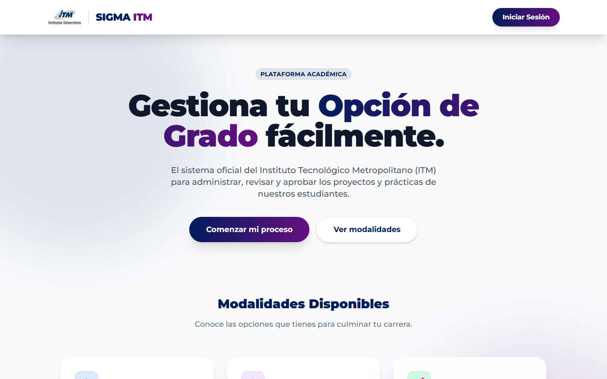
</p>
<p align="center"><em>Figura 1: Pantalla principal de bienvenida con identidad visual ITM, encabezado institucional y acceso directo a la plataforma.</em></p>

**Componentes clave de la pantalla de bienvenida:**
- **Barra de Navegación Superior:** Logotipo oficial del ITM y botón de acceso **"Iniciar Sesión"**.
- **Hero Section:** Mensaje central *"Gestiona tu Opción de Grado fácilmente"*, con acceso rápido al inicio del trámite.
- **Acciones Disponibles:**
  - Botón **"Comenzar mi proceso"**: Redirige al inicio de sesión o formulario de registro.
  - Botón **"Ver modalidades"**: Desplaza la vista hacia el catálogo reglamentario.

---

### 3.2 Catálogo Interactivo de las 10 Modalidades de Grado

Desplazando la vista hacia la sección inferior de la pantalla de bienvenida, se presenta el catálogo completo de las modalidades de opción de grado reconocidas por la institución:

<p align="center">
  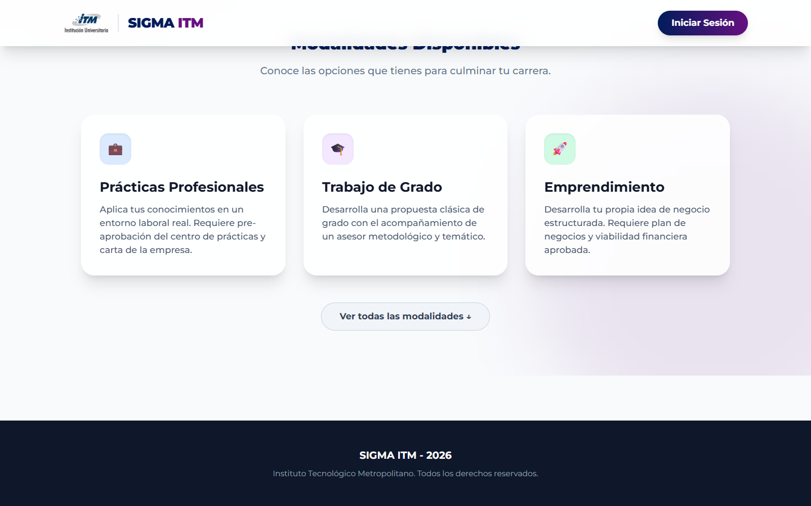
</p>
<p align="center"><em>Figura 2: Despliegue interactivo de las opciones de grado del ITM con íconos temáticos y descripciones normativas.</em></p>

---

### 3.3 Inicio de Sesión — Pantalla de Login y Accesos Rápidos Demo

El ingreso seguro al sistema se realiza a través de la interfaz de autenticación:

<p align="center">
  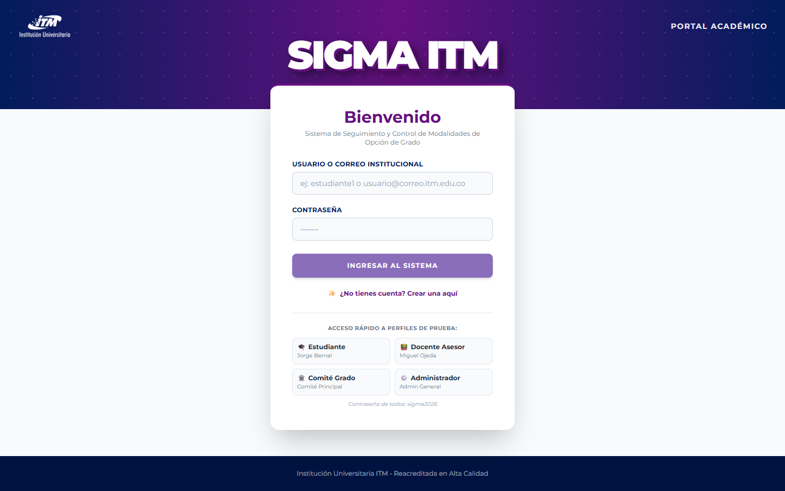
</p>
<p align="center"><em>Figura 3: Pantalla de inicio de sesión con soporte para usuario/correo institucional y panel de acceso rápido para demostración.</em></p>

**Características funcionales del Login:**
1. **Credenciales Flexibles:** Admite el nombre de usuario institucional (`estudiante1`, `asesor1`, `comite1`, `admin1`) o la dirección de correo oficial (`usuario@correo.itm.edu.co`).
2. **Protección contra Fuerza Bruta:** Limitación estricta de peticiones por IP mediante cabeceras HTTP 429.
3. **Zona de Acceso Rápido (Entorno Demo):** Cuatro botones de un solo clic que permiten alternar instantáneamente entre los roles del sistema (Estudiante: Jorge Bernal, Docente Asesor: Miguel Ojeda, Comité: Comité Principal, Administrador: Admin General).

---

### 3.4 Formulario Oficial de Registro de Estudiantes

Aquellos estudiantes que ingresan por primera vez al sistema disponen del formulario de registro en línea accesible desde el enlace *"¿No tienes cuenta? Crear una aquí"*:

<p align="center">
  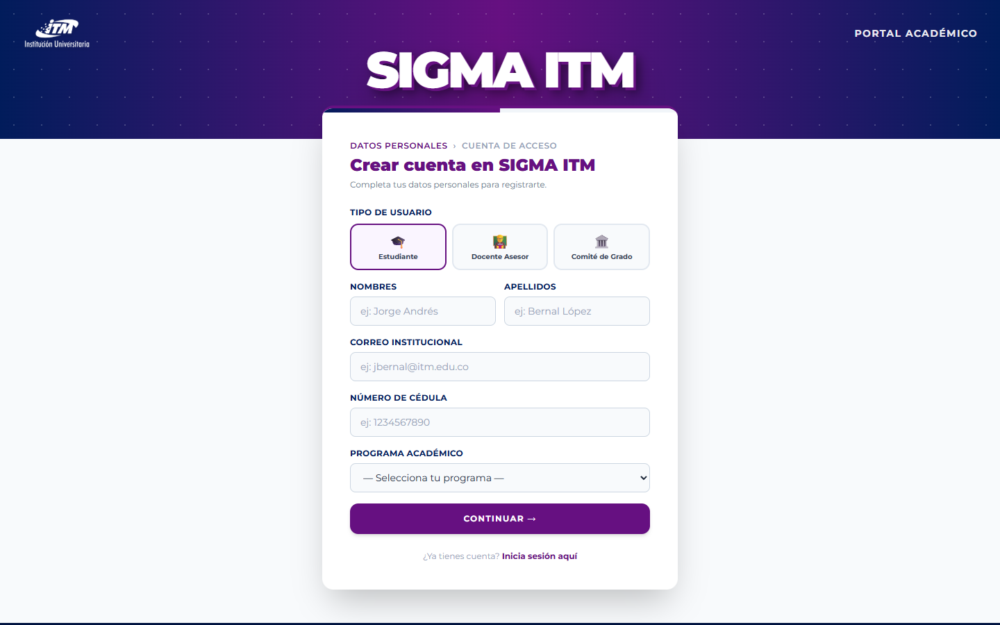
</p>
<p align="center"><em>Figura 4: Formulario estructurado para registro de nuevos aspirantes con captura de información académica y personal.</em></p>

**Campos obligatorios del formulario:**
- **Nombres y Apellidos:** Nombre completo del estudiante según su documento de identidad.
- **Cédula de Ciudadanía:** Número de identificación único registrado en el sistema institucional.
- **Correo Institucional ITM:** Debe pertenecer obligatoriamente al dominio oficial `@correo.itm.edu.co`.
- **Programa Académico:** Menú desplegable con los programas de pregrado y posgrado de la Facultad de Ingenierías.
- **Contraseña:** Clave de acceso con verificación de longitud mínima y seguridad.

---

### 3.5 Flujo de Activación y Auditoría de Cuentas Nuevas

> [!IMPORTANT]
> **Aprobación de Seguridad:** Por directriz institucional de seguridad informática, las cuentas recién creadas quedan registradas en estado inactivo (`is_active = False`). El Administrador del ITM valida la identidad del solicitante en el sistema institucional y activa la cuenta para habilitar su acceso.

---

## 4. Módulo del Estudiante: Radicación, Seguimiento y Certificación

### 4.1 Descripción del Panel del Estudiante

Una vez autenticado con rol de estudiante, el usuario accede a su entorno personalizado de trabajo:

<p align="center">
  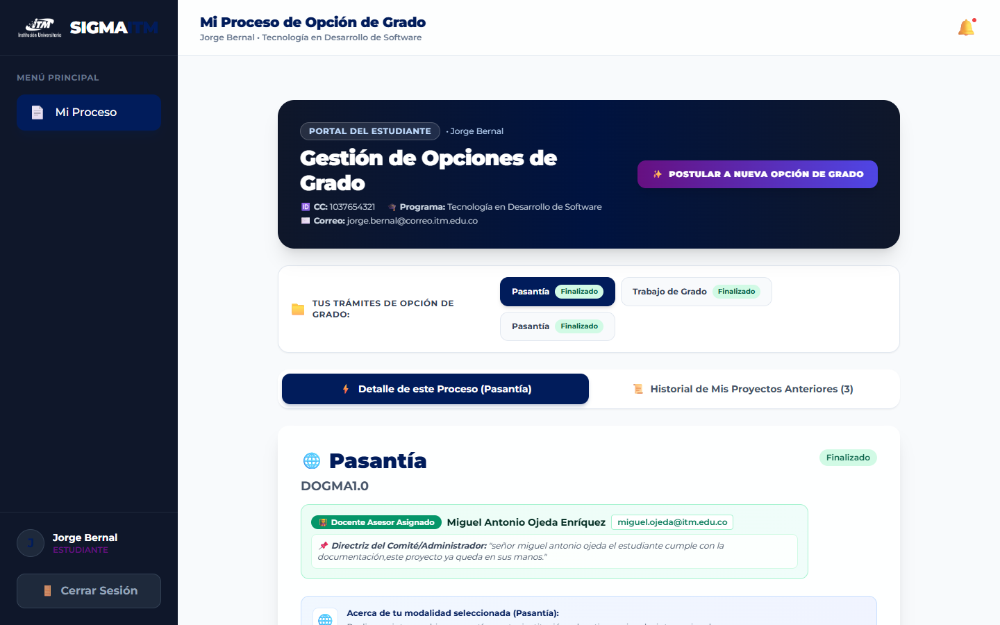
</p>
<p align="center"><em>Figura 5: Entorno principal del estudiante Jorge Bernal con tarjeta de identidad, estado del trámite y accesos a expedientes.</em></p>

---

### 4.2 Guía de Radicación: Selección y Formulario Multibloque

Al pulsar sobre el botón **"POSTULAR A NUEVA OPCION DE GRADO"**, se despliega el formulario integral estructurado en 4 bloques funcionales:

<p align="center">
  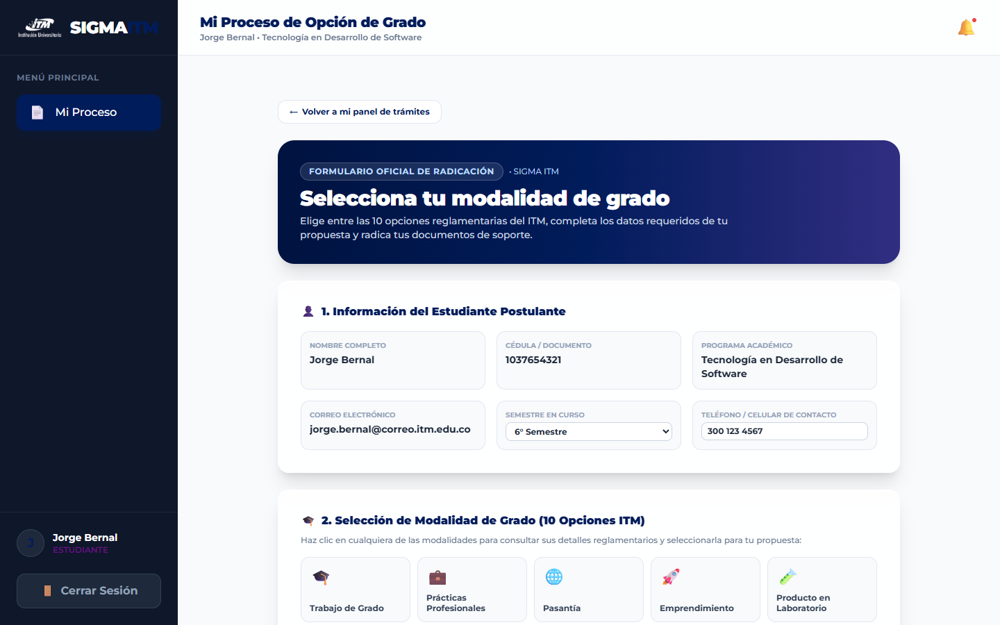
</p>
<p align="center"><em>Figura 6: Formulario estructurado con selección de modalidad, ficha técnica reglamentaria y campos obligatorios de radicación.</em></p>

**Estructura de los 4 Bloques:**
1. **Bloque 1 — Datos Personales y Académicos:** Semestre actual, programa y teléfono de contacto.
2. **Bloque 2 — Selección de Modalidad (10 Opciones ITM):** Cuadrícula interactiva con íconos temáticos y ficha descriptiva del reglamento académico.
3. **Bloque 3 — Información de la Propuesta:** Título definitivo (máximo 250 caracteres) y resumen de justificación/alcance.
4. **Bloque 4 — Carga de Documentos Iniciales Obligatorios:** Carga simultánea de propuesta de grado, paz y salvo académico y carta de presentación.

---

### 4.3 Interpretación del Stepper de Progreso y Línea de Tiempo

Para brindar total transparencia en el ciclo de vida de la postulación, el sistema cuenta con una línea de tiempo interactiva:

<p align="center">
  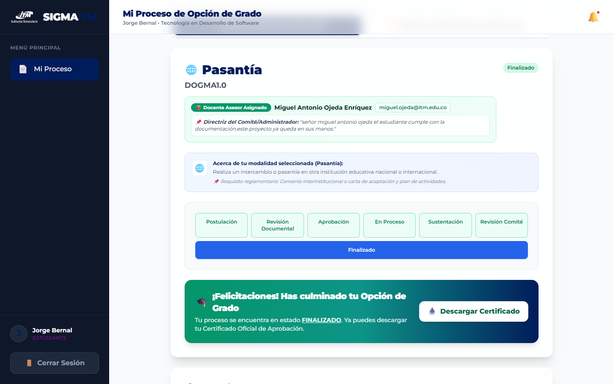
</p>
<p align="center"><em>Figura 7: Vista detallada del stepper de progreso con la etapa activa, hitos alcanzados y directrices del comité.</em></p>

**Estados y responsabilidades en el Stepper:**
```
[1. Postulación]   -->   [2. Revisión Doc.]   -->   [3. Aprobación]   -->   [4. En Proceso]   -->   [5. Sustentación]   -->   [6. Rev. Comité]   -->   [7. Finalizado]
  (Estudiante)               (Comité)                  (Comité)               (Asesor)                (Asesor)                 (Comité)            (Certificado PDF)
```

---

### 4.4 Carga, Gestión y Descarga de Documentos Anexos

En el expediente del proyecto, el estudiante dispone de la herramienta de gestión documental institucional:

<p align="center">
  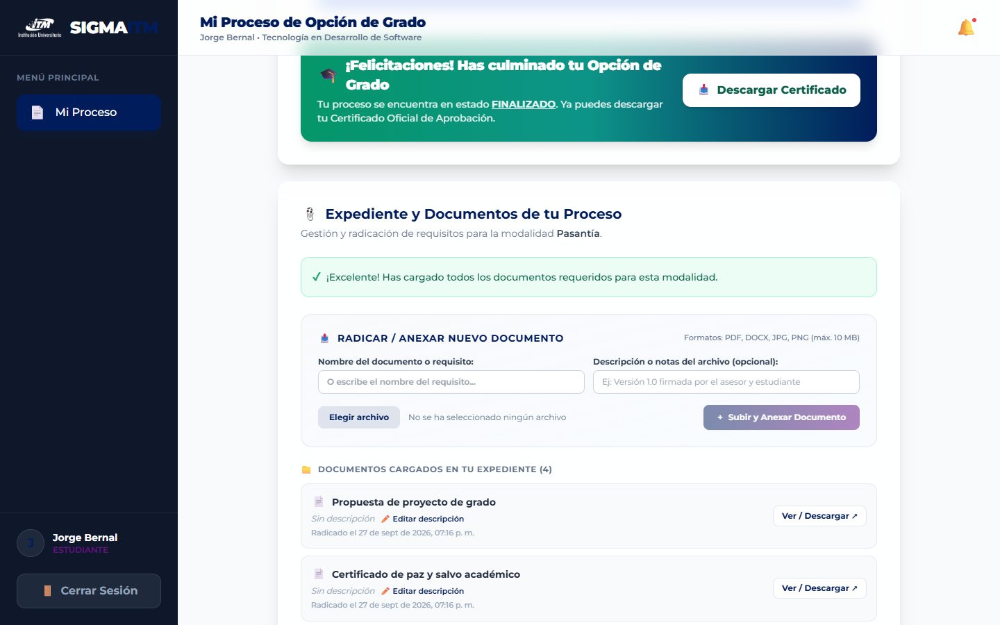
</p>
<p align="center"><em>Figura 8: Interfaz para carga de archivos con validación en cliente, listado de documentos vigentes y enlaces de descarga.</em></p>

**Procedimiento para adjuntar soportes:**
1. Ingrese el nombre descriptivo del documento en el campo asignado (ej. `Anteproyecto_Final_V2`).
2. Haga clic en **"Examinar..."** y localice el archivo en formato PDF, Word o ZIP.
3. El sistema valida el tamaño (máximo 10 MB).
4. Presione **"Subir Archivo"**. El backend verifica la autenticidad binaria mediante **Magic Bytes** y lo anexa al expediente.

---

### 4.5 Alerta de Corrección y Protocolo de Subsanación con Archivo

Cuando el Comité de Grados o el Docente Asesor solicitan ajustes a la propuesta, el sistema bloquea preventivamente el avance y muestra una alerta destacada en amarillo:

<p align="center">
  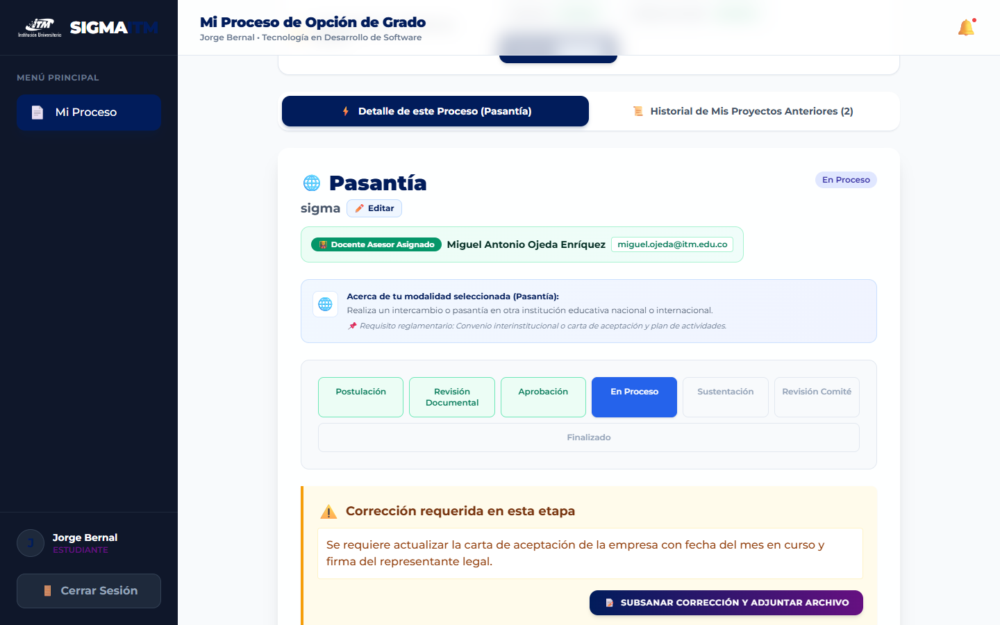
</p>
<p align="center"><em>Figura 9: Alerta visual de trámite en pausa por corrección pendiente con la observación exacta emitida por el evaluador.</em></p>

Al pulsar sobre el botón **"Subsanar Corrección"**, se abre el modal interactivo de entrega:

<p align="center">
  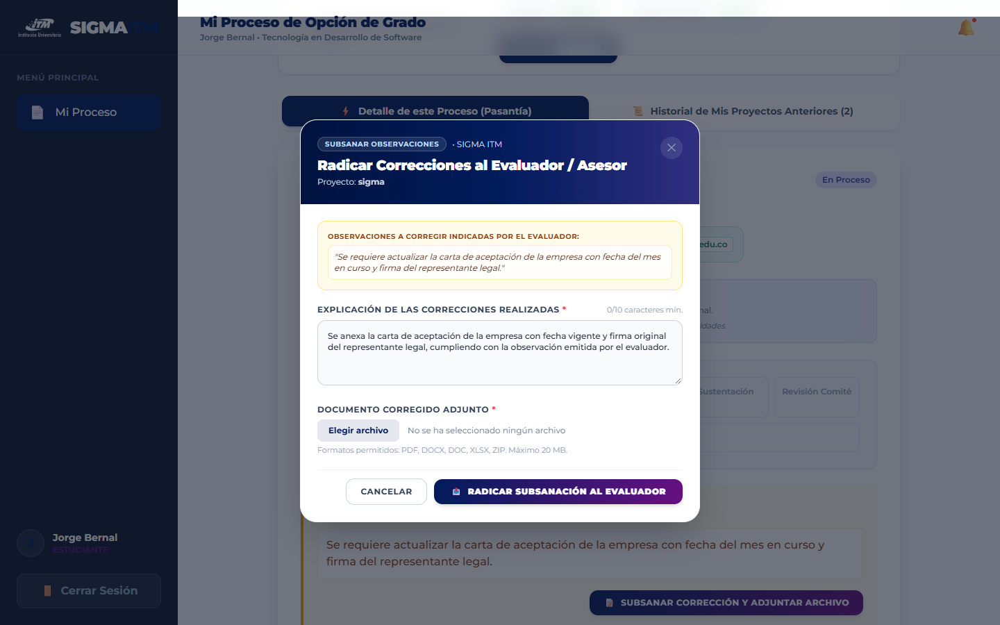
</p>
<p align="center"><em>Figura 10: Formulario modal para ingreso de explicaciones detalladas y carga del documento corregido para desbloquear el trámite.</em></p>

**Requisitos para subsanar con éxito:**
- Mensaje explicativo de mínimo 10 caracteres detallando los ajustes efectuados.
- Adjuntar obligatoriamente el archivo corregido en formato PDF o Word.
- Al confirmar, el trámite se descongela automáticamente y notifica al evaluador.

---

### 4.6 Historial Académico de Proyectos y Expedientes Anteriores

Para aquellos estudiantes que han cursado o cerrado opciones de grado previamente, el sistema preserva su registro histórico completo:

<p align="center">
  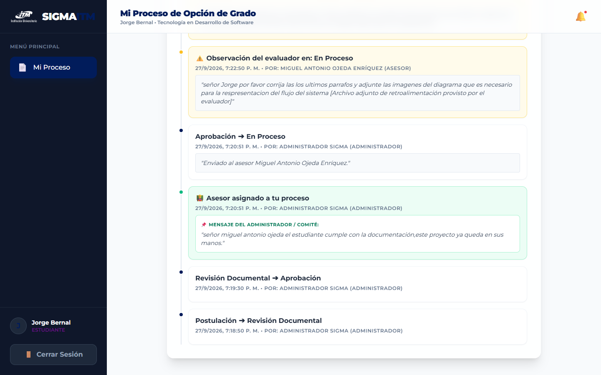
</p>
<p align="center"><em>Figura 11: Registro histórico de trámites finalizados con indicación de fechas, modalidades y acceso a actas.</em></p>

---

### 4.7 Generación y Descarga del Certificado Oficial de Grado (PDF)

Una vez el proceso alcanza el estado **`FINALIZADO`**, se activa el botón de descarga del **Certificado Oficial de Opción de Grado**:

<p align="center">
  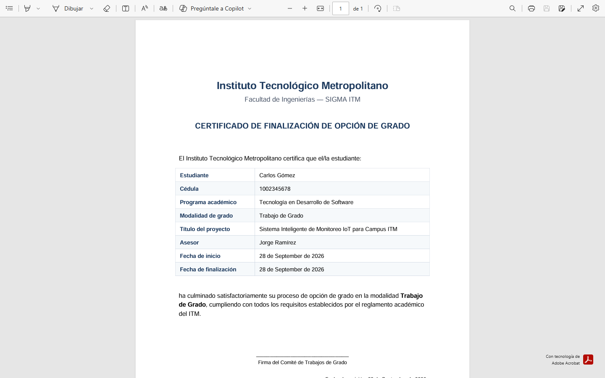
</p>
<p align="center"><em>Figura 12: Certificado oficial en PDF con escudo institucional ITM, datos del graduando, modalidad avalada y hash criptográfico SHA-256.</em></p>

**Atributos de seguridad del Certificado Oficial:**
- Generado dinámicamente con motor **ReportLab**.
- Escudo institucional y membrete oficial de la Facultad de Ingenierías.
- Calificación definitiva obtenida en la sustentación y número de Acta de Grado.
- Código hash **SHA-256** al pie de página para validación irrefutable ante la Secretaría General.

---

## 5. Módulo del Docente Asesor: Supervisión, Avances y Sustentación

### 5.1 Panel de Control del Docente Asesor

Al iniciar sesión como Docente Asesor (ej. docente Miguel Ojeda), el usuario visualiza los proyectos que le han sido formalmente asignados por el Comité:

<p align="center">
  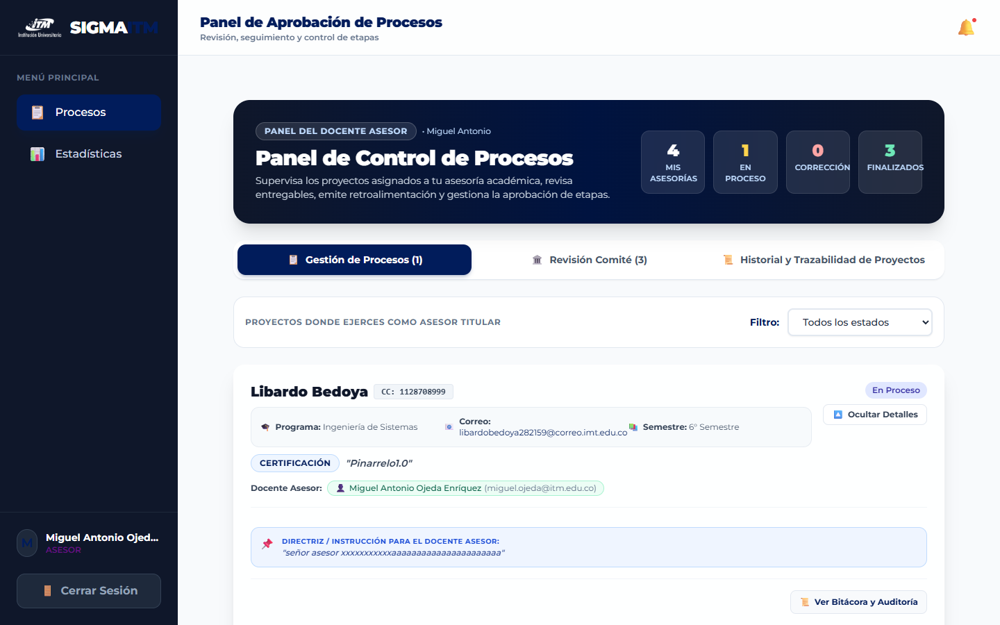
</p>
<p align="center"><em>Figura 13: Vista de gestión del Docente Asesor con expedientes asignados, estado del desarrollo y controles de asesoría.</em></p>

---

### 5.2 Gestión de la Etapa de Desarrollo (EN_PROCESO)

Durante la etapa de ejecución, el asesor cuenta con herramientas para:
- Revisar entregables periódicos de los estudiantes.
- Registrar observaciones técnicas y acuerdos de reunión.
- Solicitar correcciones formativas si el informe presenta inconsistencias metodológicas.

---

### 5.3 Devolución Formativa vs. Visto Bueno

- **Solicitar Corrección:** Si el avance no cumple con los estándares exigidos, el docente solicita ajustes documentales pausando la etapa hasta que el estudiante subsane.
- **Otorgar Visto Bueno:** Cuando el trabajo cumple el 100% de los objetivos propuestos, el docente presiona **"Dar Visto Bueno (Avanzar a Sustentación)"**, habilitando la etapa de defensa pública.

---

### 5.4 Citación Oficial y Notificación de Sustentación al Estudiante

Al programar la defensa del proyecto, el Asesor hace clic en **"Notificar Sustentación"**, abriendo el modal de citación formal:

<p align="center">
  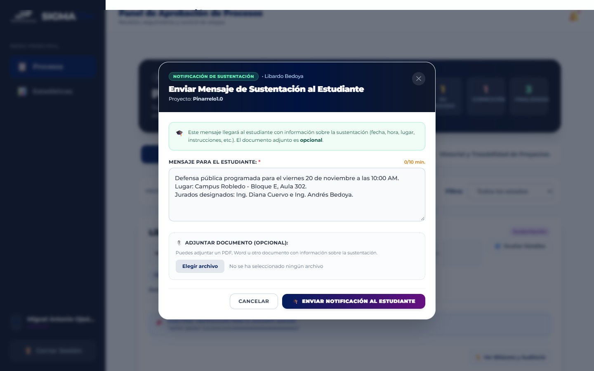
</p>
<p align="center"><em>Figura 14: Interfaz del asesor para fijar fecha, hora, aula física o enlace virtual y jurados evaluadores designados.</em></p>

---

### 5.5 Calificación de Jurados y Remisión de Acta al Comité

Tras la defensa del estudiante:
1. El docente registra la calificación final en escala de **0.0 a 5.0**.
2. Ingresa el concepto evaluativo emitido por los jurados.
3. Si la nota es igual o superior a **3.0**, el trámite avanza automáticamente a la etapa de **Revisión del Comité** para su ratificación y cierre.

---

## 6. Módulo del Comité de Grados: Dictamen, Asignación y Gobierno

### 6.1 Panel de Control de Procesos y KPIs en Tiempo Real

El Comité de Trabajos de Grado cuenta con un panel integral con métricas en vivo e indicadores de gestión:

<p align="center">
  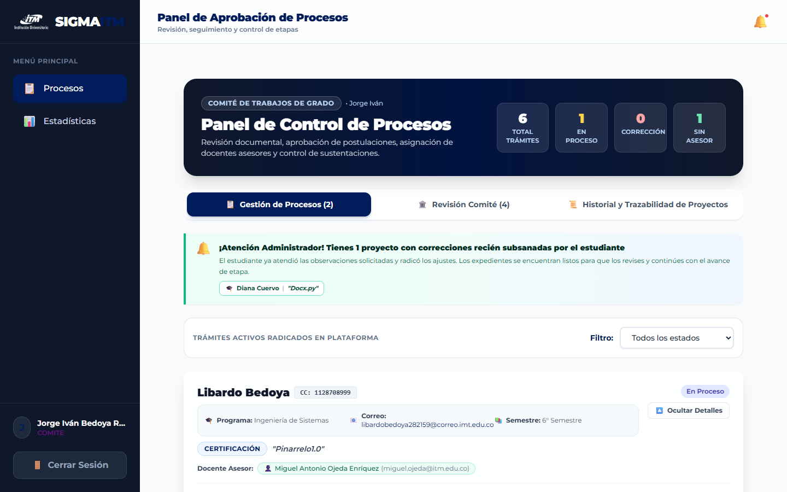
</p>
<p align="center"><em>Figura 15: Bandeja de trámites con indicadores operativos (Total Trámites, En Proceso, Corrección, Sin Asesor) y filtros por estado.</em></p>

---

### 6.2 Acordeón de Expediente Detallado y Cotejo Documental

Al seleccionar un expediente, el Comité puede desplegar el acordeón completo del proyecto:

<p align="center">
  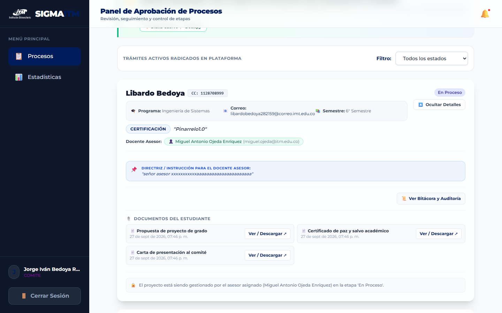
</p>
<p align="center"><em>Figura 16: Expediente con visualización de antecedentes, modalidad seleccionada, documentos aportados y controles de dictamen.</em></p>

---

### 6.3 Solicitud de Corrección con Pliego de Observaciones

Si el Comité identifica deficiencias en el anteproyecto o en las certificaciones aportadas, hace clic en **"Pedir Corrección"**:

<p align="center">
  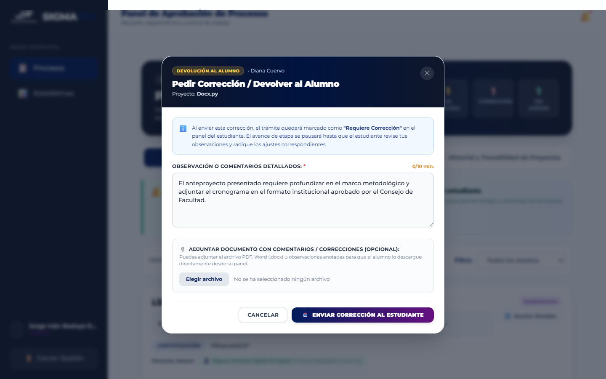
</p>
<p align="center"><em>Figura 17: Modal de observaciones técnicas institucionales y adjunción de pliegos de corrección para el estudiante.</em></p>

---

### 6.4 Asignación de Docente Asesor y Redacción de Directriz Técnica

En la etapa de `APROBACION`, el Comité o el Administrador asigna al docente responsable mediante el modal institucional:

<p align="center">
  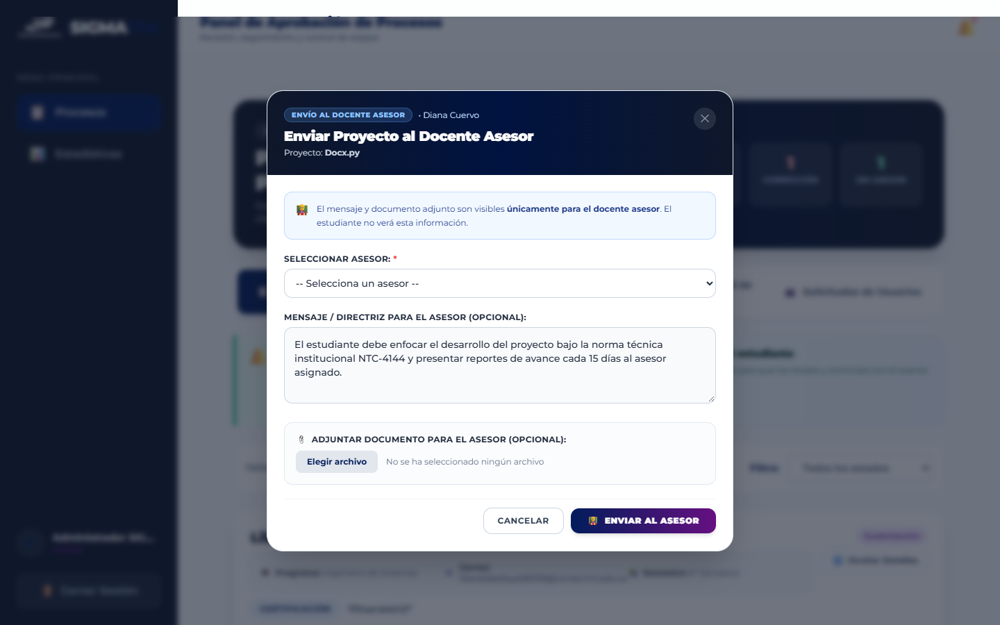
</p>
<p align="center"><em>Figura 18: Formulario de asignación docente con selector de profesores activos y redacción de directriz institucional obligatoria.</em></p>

**Requisitos de la Asignación:**
- Seleccionar un profesor del listado de docentes activos de la facultad.
- Redactar la **Directriz Técnica Institucional** obligatoria (mínimo 10 caracteres).
- Al guardar, el proyecto transiciona a la etapa **`EN_PROCESO`** y queda bajo la tutela del asesor.

---

### 6.5 Ratificación de Sustentaciones y Cierre Definitivo de Expedientes

En la pestaña **Revisión Comité**, los miembros del comité reciben las sustentaciones aprobadas:
- Verifican la nota numérica y el acta de sustentación.
- Asignan el número oficial de **Acta de Grado** del Consejo de Facultad.
- Presionan **"Ratificar y Finalizar Proceso"**, concluyendo exitosamente la opción de grado.

---

### 6.6 Pestaña de Historial y Trazabilidad Institucional

El sistema dispone de una pestaña dedicada a la trazabilidad absoluta de todos los proyectos de la facultad:

<p align="center">
  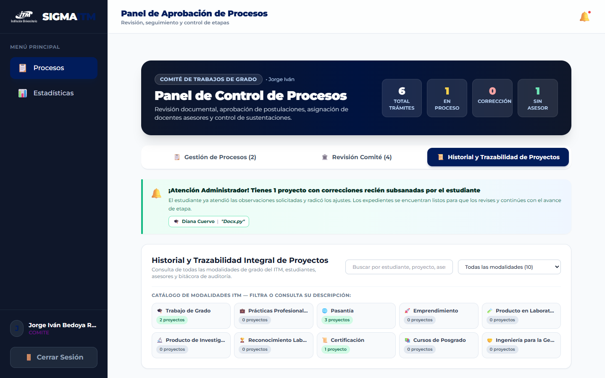
</p>
<p align="center"><em>Figura 19: Interfaz de búsqueda, filtros por modalidad y trazabilidad histórica de expedientes para auditorías de calidad.</em></p>

---

### 6.7 Causales Reglamentarias de Rechazo Definitivo

El Comité puede denegar una solicitud bajo las siguientes causales formales:
- Inconsistencia o falsedad en la documentación presentada.
- No cumplimiento de los créditos mínimos o requisitos previos de la modalidad.
- Vencimiento insubsanable de los plazos reglamentarios de subsanación.
- Dictamen de reprobación en la sustentación pública (calificación inferior a 3.0).

---

## 7. Módulo del Administrador: Gobierno Global y Analítica Institucional

### 7.1 Panel de Supervisión y Control Global

El Administrador del sistema cuenta con acceso pleno sobre todas las etapas, roles y expedientes:

<p align="center">
  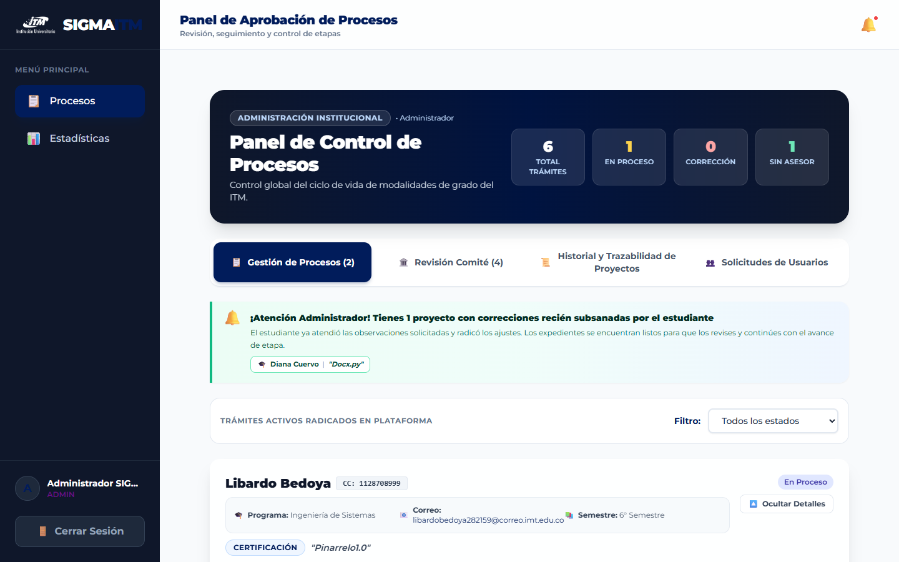
</p>
<p align="center"><em>Figura 20: Panel administrativo con privilegios globales de transición, control de usuarios y supervisión académica.</em></p>

---

### 7.2 Tablero Analítico Institucional (Dashboard)

En la ruta `/app/dashboard`, la Coordinación y Dirección de Facultad disponen de métricas visuales construidas con la librería **Recharts**:

<p align="center">
  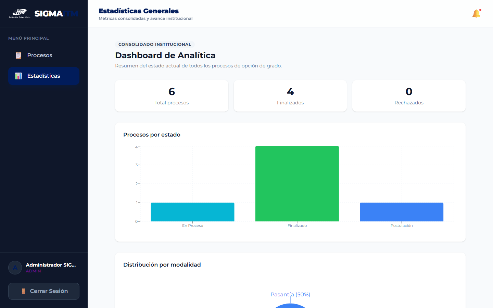
</p>
<p align="center"><em>Figura 21: Gráfico de barras interactivo que clasifica los trámites por etapa del ciclo de vida académico.</em></p>

---

### 7.3 Gráficos de Distribución por Modalidad y Tiempos de Respuesta

<p align="center">
  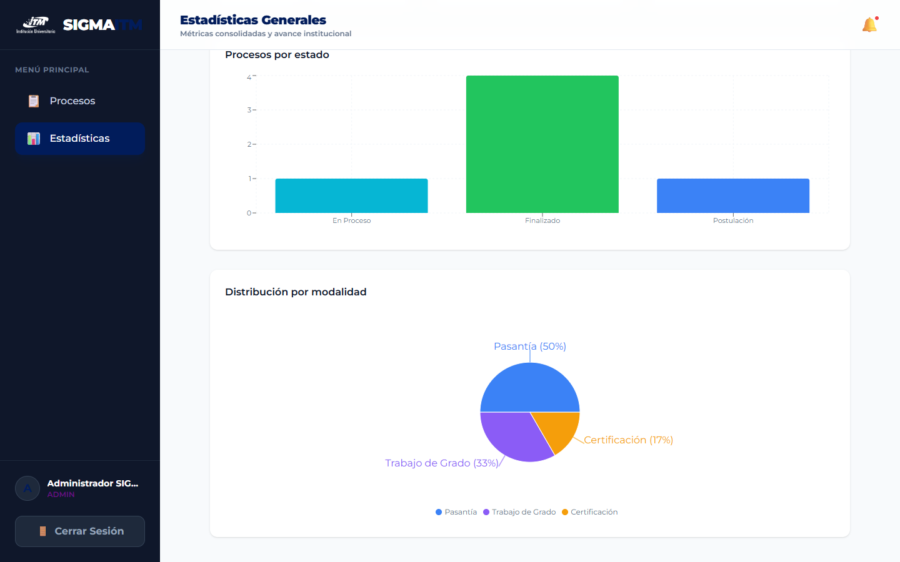
</p>
<p align="center"><em>Figura 22: Gráfico circular que visualiza la concentración porcentual de los estudiantes entre las 10 modalidades de grado.</em></p>

---

### 7.4 Auditoría Forense — Bitácora Inmutable HistorialEstado

Cada cambio de estado, nota de asesoría, directriz o subida de archivo genera un registro cronológico en la base de datos:
- Identificador único del trámite.
- Usuario autor y rol en el momento de la ejecución.
- Estado anterior y nuevo estado alcanzado.
- Observaciones y marcas de tiempo UTC indelebles.

---

## 8. Máquina de Estados: Ciclo de Vida Completo de una Postulación

### 8.1 Diagrama Oficial de la Máquina de Estados

<p align="center">
  
</p>
<p align="center"><em>Figura 23: Diagrama de transiciones y ciclo de vida de la máquina de estados de SIGMA ITM.</em></p>

---

### 8.2 Matriz Detallada de Transiciones y Restricciones

| Estado Inicial | Estado Siguiente | Responsable | Condición Previa | Resultado en el Sistema |
| :--- | :--- | :--- | :--- | :--- |
| *Inicio* | `POSTULACION` | Estudiante | Formulario y anexo inicial cargados | Trámite radicado y notificado |
| `POSTULACION` | `REVISION_DOCUMENTAL` | Comité | Solicitud recibida | Apertura formal de expediente |
| `REVISION_DOCUMENTAL` | `APROBACION` | Comité | Documentos validados conforme al reglamento | Expediente listo para asignación de asesor |
| `REVISION_DOCUMENTAL` | `REVISION_DOCUMENTAL` | Comité | Documento incompleto o con inconsistencias | Activa `requiere_correccion` y pausa el trámite |
| `APROBACION` | `EN_PROCESO` | Comité | Selección de docente asesor y directriz emitida | Inicio oficial de la etapa de desarrollo |
| `EN_PROCESO` | `EN_PROCESO` | Asesor | Observaciones formativas de avance | Notifica ajustes requeridos al estudiante |
| `EN_PROCESO` | `SUSTENTACION` | Asesor | Objetivos cumplidos al 100% y Visto Bueno | Habilita agenda de sustentación |
| `SUSTENTACION` | `REVISION_COMITE` | Asesor | Sustentación celebrada con nota >= 3.0 | Envío de acta para ratificación |
| `REVISION_COMITE` | `FINALIZADO` | Comité | Acta de Consejo de Facultad asignada | Emisión de Certificado Oficial PDF con SHA-256 |
| *Cualquier Etapa* | `RECHAZADO` | Comité / Asesor | Causal reglamentaria o reprobación definitiva | Cierre y archivo del expediente |

---

## 9. Casos Prácticos de Extremo a Extremo (Walkthrough Completo)

### 9.1 Caso A: Flujo Regular Aprobado (Trabajo de Grado)

1. **Día 1:** La estudiante Valentina Ríos se registra en SIGMA ITM. El Administrador verifica su matrícula activa y aprueba su cuenta.
2. **Día 2:** Valentina inicia sesión, selecciona la modalidad **Trabajo de Grado**, ingresa el título *"Sistema IoT para Monitoreo de Calidad del Aire en Campus ITM"* y adjunta su anteproyecto en PDF.
3. **Día 3:** El Comité de Grados revisa el anteproyecto y verifica los créditos aprobados. Emite dictamen favorable avanzando a **`APROBACION`**.
4. **Día 4:** El Comité asigna al docente asesor Carlos Mario Pérez y registra la directriz: *"Enfocar el prototipo en sensores MQ-135 calibrados bajo norma técnica nacional."* El estado pasa a **`EN_PROCESO`**.
5. **Meses 1 a 4:** Valentina y su asesor desarrollan el proyecto con entregas y retroalimentaciones periódicas registradas en la bitácora.
6. **Mes 5:** El asesor otorga el **Visto Bueno** y programa la sustentación para el 15 de noviembre a las 10:00 AM en el Aula E-204.
7. **15 de Noviembre:** Se realiza la defensa pública. El jurado asigna una calificación de **4.8 (Aprobado con honores)**. El asesor remite el acta al Comité.
8. **16 de Noviembre:** El Comité ratifica el resultado, asigna el Acta N° `ITM-FI-2026-089` y finaliza el proceso (**`FINALIZADO`**). Valentina descarga de inmediato su Certificado Oficial con firma SHA-256.

---

### 9.2 Caso B: Flujo con Corrección Documental (Prácticas Profesionales)

1. El estudiante Juan Camilo radica su postulación a **Prácticas Profesionales** pero adjunta una constancia de ARL con fecha vencida.
2. El Comité realiza la revisión documental y selecciona la opción **"Solicitar Corrección"**, detallando: *"La certificación de ARL aportada está vencida; debe adjuntar la certificación vigente del mes en curso emitida por la aseguradora."*
3. El trámite se pausa y activa la alerta amarilla en el panel de Juan Camilo.
4. Juan Camilo gestiona el documento con su empresa, ingresa al panel, redacta su mensaje de subsanación y carga el nuevo certificado en PDF.
5. El Comité recibe la notificación, valida el documento subsanado y aprueba el trámite hacia la etapa de asignación.

---

### 9.3 Caso C: Flujo de Rechazo por Incumplimiento Normativo

1. Un estudiante radica una propuesta de Pasantía sin convenio institucional interinstitucional suscrito.
2. El Comité otorga un plazo reglamentario de 15 días hábiles para subsanar los requisitos legales.
3. Cumplido el término sin que se presente el convenio avalado por la Dirección de Cooperación Internacional, el Comité selecciona **"Rechazar Definitivamente"** citando el artículo reglamentario aplicable.
4. El sistema archiva el expediente en estado **`RECHAZADO`**, preservando el registro en la bitácora histórica y notificando formalmente al estudiante.

---

## 10. Preguntas Frecuentes y Solución de Problemas (Troubleshooting)

**P1: ¿Por qué mi cuenta recién creada no me permite iniciar sesión?**  
*R:* Por política de seguridad institucional, toda cuenta nueva requiere activación previa por parte del Administrador institucional del ITM. Una vez validada su información académica, el acceso quedará habilitado de inmediato.

**P2: ¿Puedo modificar la modalidad de grado una vez radicada la propuesta?**  
*R:* Mientras el trámite se encuentre en estado inicial de postulación o revisión, el Comité puede autorizar la modificación. Si el proyecto ya se encuentra en etapa de desarrollo con asesor asignado, debe solicitarse la cancelación formal antes de iniciar un nuevo trámite.

**P3: ¿Qué debo hacer si el sistema rechaza mi archivo al intentar subirlo?**  
*R:* Verifique que el archivo no supere los 10.0 MB y que corresponda a un formato permitido (`.pdf`, `.docx` o `.zip`). Si convirtió un archivo renombrando manualmente su extensión, el motor de seguridad de **Magic Bytes** lo rechazará. Exporte el documento directamente a formato PDF estándar desde Microsoft Word o su procesador de texto original.

**P4: ¿Cómo se comprueba la autenticidad del Certificado Oficial de Grado?**  
*R:* Cada certificado generado incluye al pie de página un hash criptográfico **SHA-256** único e irrepetible. La Secretaría General y los evaluadores pueden contrastar dicho hash con la base de datos de SIGMA ITM para validar su legitimidad.

---
*Manual Oficial de Usuario Integral — Sistema SIGMA ITM | Facultad de Ingenierías | Instituto Tecnológico Metropolitano (2026)*
