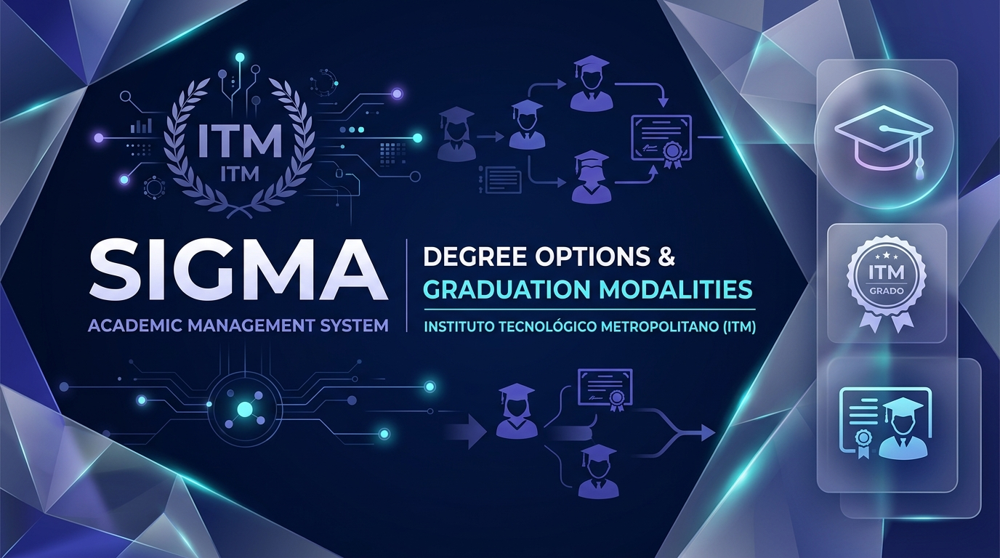
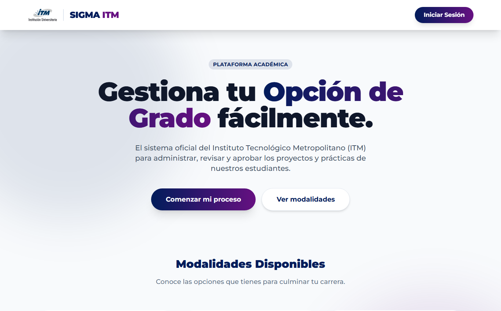
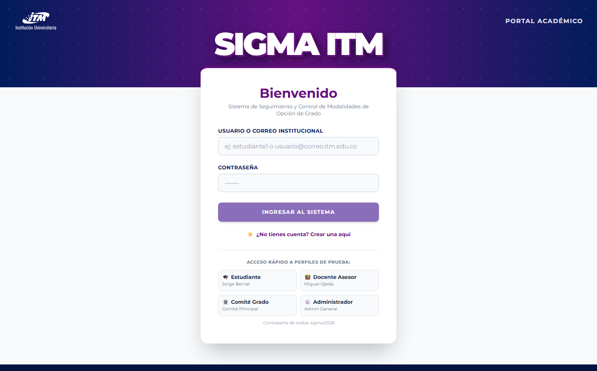
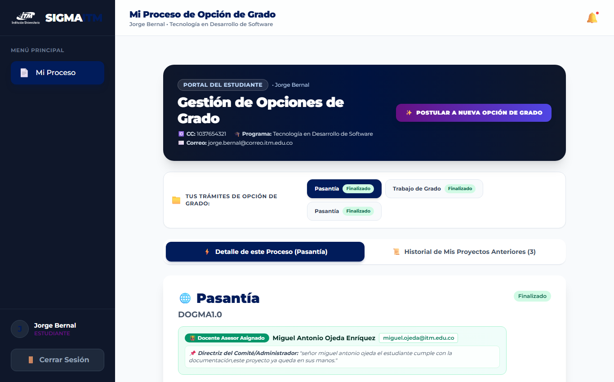
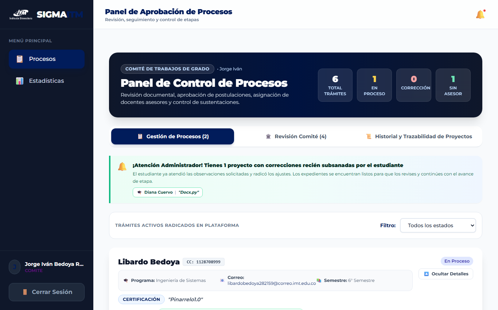

# 📘 SIGMA ITM — Manual de Usuario Oficial
### Sistema Integral de Gestión de Modalidades de Grado
**Facultad de Ingenierías — Instituto Tecnológico Metropolitano (ITM)**  
*Medellín, Colombia | Versión del Sistema: 1.0 (2026)*

---

  

---

## 📑 Tabla de Contenidos

1. [Introducción y Objetivos del Sistema](#1-introducción-y-objetivos-del-sistema)
2. [Roles de Usuario y Matriz de Acceso](#2-roles-de-usuario-y-matriz-de-acceso)
3. [Requisitos Técnicos del Sistema](#3-requisitos-técnicos-del-sistema)
4. [Módulo 1: Acceso, Registro y Seguridad](#4-módulo-1-acceso-registro-y-seguridad)
   - [4.1 Portal de Bienvenida (Landing Page)](#41-portal-de-bienvenida-landing-page)
   - [4.2 Inicio de Sesión](#42-inicio-de-sesión)
   - [4.3 Registro de Cuentas y Activación Administrativa](#43-registro-de-cuentas-y-activación-administrativa)
5. [Módulo 2: Manual del Estudiante](#5-módulo-2-manual-del-estudiante)
   - [5.1 Portal del Estudiante](#51-portal-del-estudiante)
   - [5.2 Radicación de una Nueva Opción de Grado](#52-radicación-de-una-nueva-opción-de-grado)
   - [5.3 Catálogo de las 10 Modalidades y Documentos Obligatorios](#53-catálogo-de-las-10-modalidades-y-documentos-obligatorios)
   - [5.4 Monitoreo de Estado y Línea de Tiempo](#54-monitoreo-de-estado-y-línea-de-tiempo)
   - [5.5 Subsanación de Correcciones Solicitadas](#55-subsanación-de-correcciones-solicitadas)
   - [5.6 Descarga del Certificado Oficial PDF](#56-descarga-del-certificado-oficial-pdf)
6. [Módulo 3: Manual del Docente Asesor](#6-módulo-3-manual-del-docente-asesor)
   - [6.1 Panel de Asesoría Académica](#61-panel-de-asesoría-académica)
   - [6.2 Supervisión y Avance del Proyecto (`EN_PROCESO`)](#62-supervisión-y-avance-del-proyecto-en_proceso)
   - [6.3 Emisión de Directrices y Devoluciones por Corrección](#63-emisión-de-directrices-y-devoluciones-por-corrección)
   - [6.4 Visto Bueno y Programación de Sustentación](#64-visto-bueno-y-programación-de-sustentación)
7. [Módulo 4: Manual del Comité de Grados y Coordinación](#7-módulo-4-manual-del-comité-de-grados-y-coordinación)
   - [7.1 Revisión Documental Preliminar (`REVISION_DOCUMENTAL`)](#71-revisión-documental-preliminar-revision_documental)
   - [7.2 Asignación Formal de Asesor y Directriz Inicial](#72-asignación-formal-de-asesor-y-directriz-inicial)
   - [7.3 Ratificación de Sustentaciones (`REVISION_COMITE`)](#73-ratificación-de-sustentaciones-revision_comite)
   - [7.4 Cierre Definitivo y Emisión del Acta de Grado](#74-cierre-definitivo-y-emisión-del-acta-de-grado)
8. [Módulo 5: Manual del Administrador del Sistema](#8-módulo-5-manual-del-administrador-del-sistema)
   - [8.1 Gobierno de Cuentas y Aprobación de Usuarios](#81-gobierno-de-cuentas-y-aprobación-de-usuarios)
   - [8.2 Dashboard de Analítica y Métricas Institucionales](#82-dashboard-de-analítica-y-métricas-institucionales)
9. [Ciclo de Vida del Trámite y Máquina de Estados](#9-ciclo-de-vida-del-trámite-y-máquina-de-estados)
10. [Preguntas Frecuentes y Solución de Problemas (FAQ)](#10-preguntas-frecuentes-y-solución-de-problemas-faq)

---

## 1. Introducción y Objetivos del Sistema

**SIGMA ITM** (Sistema Integral de Gestión de Modalidades de Grado) es la plataforma tecnológica institucional diseñada para la Facultad de Ingenierías del ITM con el fin de digitalizar, organizar y auditar en tiempo real todo el flujo de trabajo asociado a los requisitos de grado.

### Objetivos Principales:
- **Centralización Total:** Sustituir cadenas de correos informales y formularios impresos por un expediente digital único con trazabilidad total.
- **Transparencia para el Estudiante:** Permitir conocer en qué fase exacta se encuentra su solicitud, quién es su evaluador y qué observaciones existen.
- **Rigor Académico y Calidad:** Validar automáticamente que no se puedan avanzar etapas sin cumplir con la documentación legal y técnica exigida por el reglamento del ITM.
- **Automatización Certificada:** Generar actas y certificados de culminación en PDF con código hash de verificación forense.

---

## 2. Roles de Usuario y Matriz de Acceso

El sistema implementa un estricto modelo de **Control de Acceso Basado en Roles (RBAC)**:

| Rol | Actor Institucional | Responsabilidades Principales |
| :--- | :--- | :--- |
| 👨‍🎓 **ESTUDIANTE** | Alumno matriculado en pregrado/posgrado | Radicar proyecto, subir anexos, subsanar observaciones, descargar certificado oficial. |
| 👨‍🏫 **ASESOR** | Docente asesor nombrado | Guiar el desarrollo técnico en `EN_PROCESO`, solicitar ajustes, otorgar aval y calificar sustentación. |
| 🏛️ **COMITE** | Comité de Trabajos de Grado / Coordinación | Revisar documentos iniciales, aprobar trámite, asignar asesor con directriz, ratificar acta final. |
| ⚡ **ADMIN** | Dirección de Departamento / Administrador TI | Activar usuarios nuevos, parametrizar modalidades, consultar analítica global y auditar el sistema. |

---

## 3. Requisitos Técnicos del Sistema

- **Navegadores Recomendados:** Google Chrome (v100+), Mozilla Firefox (v100+), Microsoft Edge (v100+), Safari (v15+).
- **Resolución Óptima:** 1366 x 768 píxeles en adelante (diseño 100% responsivo para tabletas y dispositivos móviles).
- **Formatos de Documentos Permitidos:** Archivos en formato `.pdf`, `.docx` o comprimidos `.zip`.
- **Límite de Tamaño:** Máximo 10 MB por archivo adjunto.
- **Seguridad de Archivos:** El sistema realiza verificación binaria (*magic bytes*); cualquier archivo renombrado maliciosamente (ej. un ejecutable `.exe` renombrado a `.pdf`) será bloqueado por el servidor.

---

## 4. Módulo 1: Acceso, Registro y Seguridad

### 4.1 Portal de Bienvenida (Landing Page)

Al ingresar a la dirección principal del sistema (`http://localhost:5173/` en desarrollo o el dominio institucional configurado), el usuario visualiza la portada con información clara de las 10 modalidades disponibles y accesos directos:

  

1. **Botón "Iniciar Sesión":** Conduce al formulario de autenticación con credenciales institucionales.
2. **Botón "Registrarse":** Permite a nuevos usuarios solicitar la creación de su cuenta.
3. **Catálogo Informativo:** Presenta los requisitos y normativas de cada una de las 10 modalidades vigentes.

---

### 4.2 Inicio de Sesión

Para ingresar al sistema, haga clic en el botón superior **"Iniciar Sesión"** o navegue a `/login`:

  

#### Pasos para Autenticarse:
1. Ingrese su **Nombre de Usuario** institucional (ej. `estudiante1`, `asesor1`, `comite`).
2. Digite su **Contraseña**.
3. Haga clic en **"Iniciar Sesión"**.
4. El sistema validará sus credenciales mediante tokens JWT con expiración automática de 20 minutos para proteger su cuenta.

> [!NOTE]
> El endpoint de autenticación cuenta con un limitador de intentos (*rate limiting*). Si introduce contraseñas incorrectas reiteradamente, su dirección IP será pausada temporalmente como medida de seguridad anti-fuerza bruta.

---

### 4.3 Registro de Cuentas y Activación Administrativa

Si es un estudiante o docente nuevo en la plataforma, seleccione la opción **"¿No tienes cuenta? Regístrate aquí"**:

1. Complete el formulario con:
   - Nombre de usuario y correo institucional (`@itm.edu.co`).
   - Cédula de ciudadanía o documento de identidad.
   - Programa académico (ej. *Ingeniería de Sistemas*, *Ingeniería Electrónica*).
   - Rol solicitado (*Estudiante* o *Docente Asesor*).
   - Contraseña segura.
2. Haga clic en **"Crear Cuenta"**.
3. **Estado Pendiente:** Por políticas de seguridad institucional, la cuenta quedará en estado inactivo (`is_active = False`) hasta que un Administrador del ITM valide su vinculación y active el acceso.

---

## 5. Módulo 2: Manual del Estudiante

### 5.1 Portal del Estudiante

Una vez autenticado con rol de estudiante, el sistema lo redirige a su panel de control personalizado:

  

En esta vista, el estudiante puede:
- Ver el estado actual de su postulación mediante una insignia dinámica con código de color.
- Consultar los datos de su asesor asignado y las directrices emitidas.
- Revisar las fechas y el lugar programados para la sustentación pública.
- Consultar la bitácora completa de observaciones y revisiones históricas.
- Descargar su Certificado Oficial de Paz y Salvo una vez concluido el proceso.

---

### 5.2 Radicación de una Nueva Opción de Grado

Si aún no cuenta con una postulación activa:

1. Haga clic en el botón **"Radicar Nueva Postulación"**.
2. Escriba el **Título del Proyecto de Grado** (debe ser claro, preciso y alineado con las líneas de investigación de la facultad).
3. Seleccione la **Modalidad de Grado** deseada en el menú desplegable.
4. Adjunte los documentos obligatorios requeridos para esa modalidad específica.
5. Presione **"Radicar Trámite"**. El sistema verificará los archivos e iniciará el proceso en estado `POSTULACION`.

---

### 5.3 Catálogo de las 10 Modalidades y Documentos Obligatorios

Antes de radicar, verifique que cuenta con los documentos requeridos:

| # | Modalidad de Grado | Código | Documentos Obligatorios a Adjuntar |
| :-: | :--- | :--- | :--- |
| **1** | **Trabajo de Grado** | `TRABAJO_GRADO` | Anteproyecto formal de grado + Certificado de paz y salvo académico. |
| **2** | **Prácticas Profesionales** | `PRACTICAS_PROFESIONALES` | Carta de aceptación de la empresa + Convenio/Afiliación ARL + Plan de labores. |
| **3** | **Pasantía de Investigación** | `PASANTIA` | Carta de aceptación del centro o institución receptora + Plan de pasantía. |
| **4** | **Emprendimiento** | `EMPRENDIMIENTO` | Plan de negocio / Modelo Canvas + Constancia de Parque E o Centro de Emprendimiento. |
| **5** | **Producto en Laboratorio** | `PRODUCTO_LABORATORIO` | Aval de la Jefatura de Laboratorios ITM + Ficha técnica del prototipo. |
| **6** | **Producto de Investigación** | `PRODUCTO_INVESTIGACION` | Constancia del Grupo de Investigación (MinCiencias) + Artículo o ponencia. |
| **7** | **Reconocimiento Laboral** | `RECONOCIMIENTO_LABORAL` | Certificación laboral (mínimo 1 año de experiencia afín) + Memoria técnica. |
| **8** | **Certificación Internacional** | `CERTIFICACION` | Voucher o certificado oficial de industria + Ficha técnica del examen. |
| **9** | **Cursos de Posgrado** | `CURSOS_POSGRADO` | Constancia de matrícula formal en posgrado + Certificado de calificaciones. |
| **10** | **Ingeniería para la Gente** | `INGENIERIA_GENTE` | Carta de la comunidad receptora + Diagnóstico comunitario + Plan de intervención. |

---

### 5.4 Monitoreo de Estado y Línea de Tiempo

La línea de tiempo visual ubicada en el panel muestra de forma interactiva el progreso cronológico del proyecto:

1. 🔵 **POSTULACIÓN:** Solicitud radicada por el estudiante.
2. 🟡 **REVISIÓN DOCUMENTAL:** Comité y Coordinación verifican anexos y validez.
3. 🟢 **APROBACIÓN:** Requisitos aprobados; pendiente asignación de asesor.
4. 🟣 **EN PROCESO:** Desarrollo del trabajo bajo supervisión docente continua.
5. 🟠 **SUSTENTACIÓN:** Defensa pública con jurados, fecha y aula asignadas.
6. 🔵 **REVISIÓN COMITÉ:** Ratificación formal de la calificación de sustentación.
7. 🏆 **FINALIZADO:** Trámite culminado con éxito y generación del acta oficial.

---

### 5.5 Subsanación de Correcciones Solicitadas

> [!WARNING]
> **Bloqueo por Corrección:** Si el Comité o su Asesor detectan inconsistencias, marcarán la postulación con `requiere_correccion = True`. Mientras este estado esté activo, el trámite queda en pausa y no podrá avanzar de etapa hasta que subsane.

#### ¿Cómo responder a una corrección?
1. Ingrese a su portal de estudiante. Verá una alerta destacada en color amarillo/ámbar con las **Observaciones del Evaluador**.
2. Prepare el documento corregido en su computador.
3. En la sección **"Subsanar Observación"**:
   - Escriba una explicación detallada de las modificaciones efectuadas.
   - Adjunte el nuevo archivo corregido (PDF o DOCX).
4. Haga clic en **"Enviar Subsanación"**.
5. El sistema notificará al evaluador, desactivará la bandera de bloqueo y reanudará el trámite para su revisión.

---

### 5.6 Descarga del Certificado Oficial PDF

Una vez que el Comité aprueba la sustentación y el trámite alcanza el estado **`FINALIZADO`**:
1. Aparecerá en su panel el botón verde **"Descargar Certificado Oficial (PDF)"**.
2. Al hacer clic, el servidor generará dinámicamente un documento oficial institucional emitido por la Facultad de Ingenierías.
3. Este documento incluye:
   - Datos completos del estudiante y programa académico.
   - Título oficial del proyecto y modalidad convalidada.
   - Nombres del docente asesor y evaluadores.
   - Código único de verificación criptográfica (Hash SHA-256).

---

## 6. Módulo 3: Manual del Docente Asesor

### 6.1 Panel de Asesoría Académica

El docente asesor ingresa con sus credenciales institucionales y es dirigido a la vista de evaluación:

  

- El asesor **solo visualiza las postulaciones donde ha sido nombrado formalmente**.
- Cuenta con acceso de lectura y descarga a todos los anexos técnicos subidos por el estudiante.

---

### 6.2 Supervisión y Avance del Proyecto (`EN_PROCESO`)

Cuando el proyecto está en etapa de ejecución:
1. El docente revisa las entregas parciales y avances de tesis o prototipo.
2. Si el avance es satisfactorio pero requiere ajustes menores, puede registrar observaciones formativas en la bitácora.
3. Si el avance presenta deficiencias metodológicas graves, el docente puede activar **"Solicitar Corrección"**, pausando el avance formal hasta que el estudiante subsane.

---

### 6.3 Visto Bueno y Programación de Sustentación

Cuando el proyecto cumple con la totalidad de los objetivos fijados:
1. El asesor presiona el botón **"Dar Visto Bueno (Avanzar a Sustentación)"**.
2. Se despliega el formulario de sustentación donde el docente registra:
   - **Fecha y Hora:** Calendario oficial de la defensa.
   - **Lugar / Enlace:** Aula física asignada en el campus o enlace de videoconferencia (ej. *Bloque 4, Aula 201* o *Microsoft Teams*).
3. El sistema envía automáticamente una notificación al estudiante y actualiza el estado a `SUSTENTACION`.

---

## 7. Módulo 4: Manual del Comité de Grados y Coordinación

### 7.1 Revisión Documental Preliminar (`REVISION_DOCUMENTAL`)

El Comité de Trabajos de Grado tiene competencia sobre todas las postulaciones radicadas en la facultad:
1. Al recibir una nueva postulación en `POSTULACION`, el evaluador inicia la verificación haciendo clic en **"Iniciar Revisión Documental"**.
2. Se cotejan los documentos contra la tabla de requisitos de la modalidad correspondiente.
3. Si los documentos están completos, se presiona **"Aprobar Requisitos (APROBACION)"**.
4. Si falta un anexo o no cumple con el formato institucional, se presiona **"Solicitar Subsanación"** indicando detalladamente el requerimiento.

---

### 7.2 Asignación Formal de Asesor y Directriz Inicial

En el estado `APROBACION`:
1. El Comité abre el expediente del estudiante.
2. Selecciona un docente en el listado desplegable de **"Docentes Asesores Activos"**.
3. Redacta la **Directriz Institucional de Asignación** (alcance, fechas de entrega esperadas y recomendaciones de comité).
4. Al confirmar la asignación, el sistema transiciona automáticamente a **`EN_PROCESO`** y notifica al docente y al estudiante.

---

### 7.3 Ratificación de Sustentaciones y Cierre (`FINALIZADO`)

Una vez que el jurado o asesor evalúa la sustentación:
1. La postulación ingresa a **`REVISION_COMITE`**.
2. El Comité verifica el acta de sustentación y la calificación otorgada.
3. Si todo está en orden, se presiona **"Ratificar y Finalizar Trámite (FINALIZADO)"**.
4. Esta acción bloquea definitivamente el expediente (los estados terminales son inmutables) y habilita la expedición del certificado oficial.

---

## 8. Módulo 5: Manual del Administrador del Sistema

### 8.1 Gobierno de Cuentas y Aprobación de Usuarios

Por políticas de seguridad, el Administrador tiene control de acceso al sistema:
1. En el menú superior, navegue a **"Usuarios Pendientes"** (`/usuarios/pendientes`).
2. Visualice las solicitudes de registro con su rol solicitado, cédula y programa.
3. Tras verificar su autenticidad en los sistemas centrales del ITM, presione **"Aprobar"** para otorgarle acceso inmediato, o **"Rechazar"** en caso de datos inconsistentes.

---

### 8.2 Dashboard de Analítica y Métricas Institucionales

El Administrador y los miembros del Comité disponen de un tablero de inteligencia académica en tiempo real:

  

El tablero proporciona:
- **Distribución por Estado:** Conteo de trámites en radicación, revisión, asesoría, sustentación y finalizados.
- **Modalidades Más Demandadas:** Gráfico comparativo de las 10 opciones de grado para toma de decisiones directivas.
- **Carga de Asesorías Docentes:** Monitoreo del número de estudiantes asignados por cada profesor para evitar sobrecargas de trabajo.
- **Tiempos Promedio de Respuesta:** Días promedio que toma una solicitud en ser atendida por el Comité.

---

## 9. Ciclo de Vida del Trámite y Máquina de Estados

El siguiente diagrama vectorial sintetiza las transiciones oficiales del sistema y los roles con competencia en cada una:

  

### Reglas Clave de Transición:
- **No se permiten saltos:** Un trámite no puede pasar de `POSTULACION` a `SUSTENTACION` sin haber cursado la revisión, aprobación y asesoría previa.
- **Inmutabilidad Terminal:** Una vez en `FINALIZADO` o `RECHAZADO`, ningún usuario (ni siquiera el Administrador) puede revertir o modificar los datos del expediente.
- **Registro Inmutable de Auditoría:** Cada cambio de estado queda registrado con fecha exacta, responsable y observación en la base de datos.

---

## 10. Preguntas Frecuentes y Solución de Problemas (FAQ)

### ¿Por qué los botones de avance están deshabilitados en mi panel?
> **Respuesta:** Verifique si su trámite tiene una observación pendiente (`requiere_correccion = True`). Si es estudiante, debe radicar el archivo subsanado. Si es evaluador, debe esperar a que el estudiante envíe la subsanación.

### ¿Puedo radicar dos modalidades de grado simultáneamente?
> **Respuesta:** No. El sistema admite una única postulación activa por estudiante. Si desea cambiar de modalidad, el trámite previo debe ser formalmente rechazado o archivado por el Comité.

### ¿Por qué mi archivo no se sube si termina en `.pdf`?
> **Respuesta:** El sistema inspecciona los bytes internos (*magic numbers*). Si guardó un archivo con formato incorrecto o un documento corrupto, el servidor lo rechazará para proteger la integridad de la base de datos. Asegúrese de exportar un PDF estándar desde Word, LibreOffice o Adobe Acrobat.

### ¿Cómo cambio mi contraseña o datos personales?
> **Respuesta:** Los cambios de contraseña o actualización de programa académico pueden solicitarse a la Coordinación Académica o directamente a través del Administrador de la plataforma.

---

*Manual elaborado para el Instituto Tecnológico Metropolitano (ITM) — Facultad de Ingenierías.*  
*SIGMA ITM © 2026. Todos los derechos reservados.*
